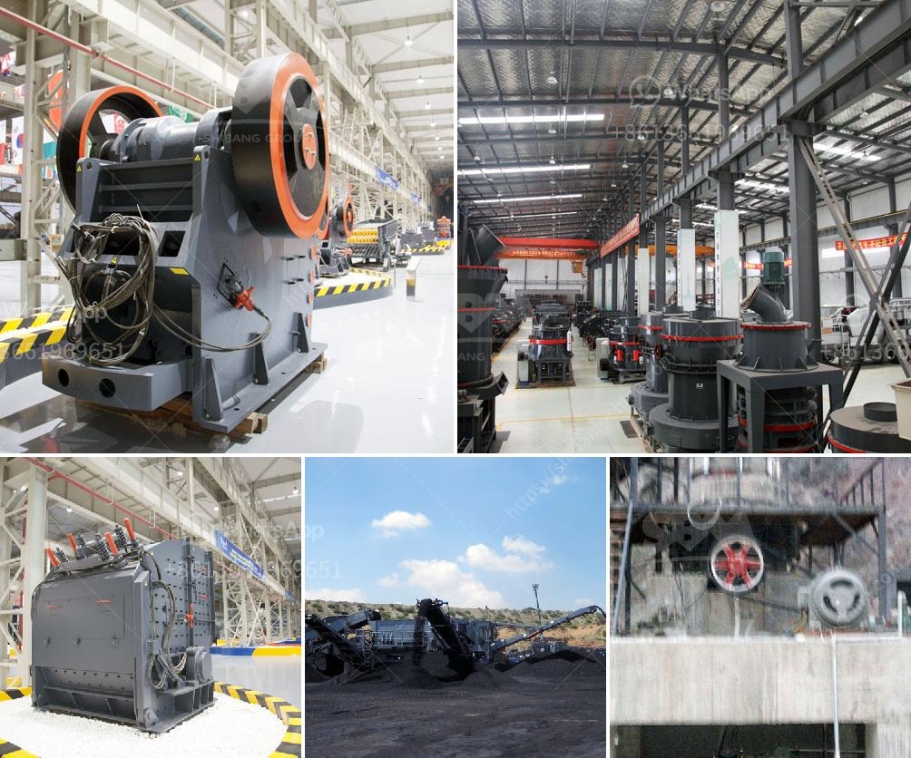

<h3>10 allis chalmers jaw crusher</h3>
Allis Chalmers is a manufacturer of agricultural and industrial equipment that was founded in 1901 and is synonymous with reliability and durability. The jaw crusher series from Allis Chalmers is a fantastic example of their ability to help their customers achieve success with their all-purpose equipment.

In mining applications, a jaw crusher is used to produce gravel for use in concrete and asphalt production, as well as in other mining processes. The Allis Chalmers jaw crusher series is undoubtedly the most popular machine for this application in the world. With over 50 years of jaw crusher manufacturing experience, Allis Chalmers has consistently been at the forefront of innovative design, delivering outstanding performance, enhancing productivity and reducing cost per tonne.

The Allis Chalmers jaw crusher features a refined and aggressive toggle plate design, optimized by a steep nip angle, delivering aggressive crushing action, and consistent high performance. Swing jaw deflection plate eliminates wear and maintains dimensionality of jaw opening, reducing downtime and increasing jaw crusher uptime. It has also elongated jaws with optimized nip angle that ensures crushing efficiency and uniform product size.

Allis Chalmers jaw crushers are equipped with hydraulic toggle cylinders that help to reduce maintenance time and increase operating efficiency. The cylinders are designed for robustness and long service life, and are easily accessible for replacement. Another important feature of the jaw crushers from Allis Chalmers is the ability to discharge the crushed product directly onto a conveyor belt, reducing the need for additional equipment and simplifying the overall crushing process.

In addition, the Allis Chalmers jaw crusher design provides excellent fatigue strength, even in the toughest quarrying conditions. This is important because a robust, strong jaw crusher can handle a wide range of materials, including concrete recycling, asphalt and quarrying applications, as well as various types of rocks and ores. The jaw crushers from Allis Chalmers are also ideal for reducing the size of hard, abrasive materials such as dolomite, granite, basalt, and quartzite.

Allis Chalmers jaw crushers are available in a wide range of sizes and models, each designed to meet the individual requirements of customers in specific quarrying and mining applications. Allis Chalmers jaw crushers can be custom-designed to meet individual crushing needs, and are available in sizes ranging from 10"x16" to 72"x84".

Allis Chalmers jaw crushers have proved to be reliable and productive in thousands of mining, quarrying, recycling and industrial applications, which has made them popular among customers looking for versatile solutions that can handle varying demands. With a proven track record of reliability, performance, and durability, the Allis Chalmers jaw crusher series is a trusted choice for customers looking to improve their crushing operations and maximize their productivity.

In conclusion, Allis Chalmers jaw crushers are versatile machines that can help customers achieve success in their mining, quarrying, recycling, and industrial applications. With a long history and impressive track record, Allis Chalmers jaw crushers have stood the test of time and delivered outstanding performance. If you are in the market for a jaw crusher, Allis Chalmers is definitely a brand to consider.
<h3>Contact us</h3><ul><li><strong>Whatsapp:&nbsp;<a href="https://wa.me/8613661969651">+8613661969651</a></strong></li><li><a href="https://swt.shibang-china.com/?git&amp;zhl&amp;10 allis chalmers jaw crusher"><strong>Online Service(chat now)</strong></a></li></ul><h3>Related</h3><ul><li><a href='stone crusher plant in westbengal.md'>stone crusher plant in westbengal</a></li><li><a href='cde sand wash plant for sale.md'>cde sand wash plant for sale</a></li><li><a href='manufacturer of quartz powder mill.md'>manufacturer of quartz powder mill</a></li><li><a href='portable gold mining hammer mills.md'>portable gold mining hammer mills</a></li><li><a href='hpc cone crusher.md'>hpc cone crusher</a></li></ul>