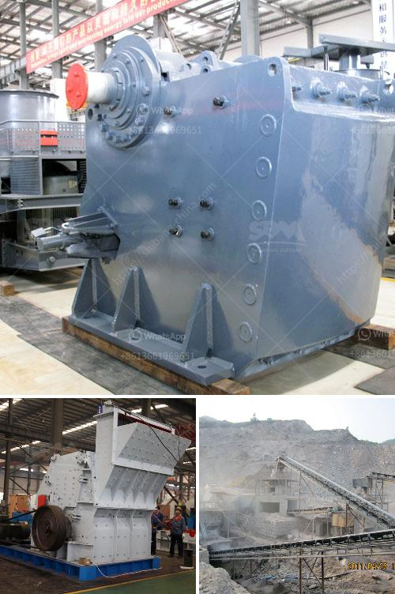

<h3>10 inches marble grinding stone</h3>
The 10-inch marble grinding stone is an essential tool for anyone who works with marble or other types of stone. This versatile tool can be used for a variety of tasks, including grinding, polishing, and shaping. With its large size and sturdy construction, it can handle heavy-duty use and provide consistent results.

One of the key features of the 10-inch marble grinding stone is its size. With a diameter of 10 inches, it provides ample surface area for grinding and polishing large areas of stone. This can help to speed up the process and make it more efficient, especially when working on larger projects.

The grinding stone is made from high-quality materials, ensuring its durability and long lifespan. It is typically made from natural stone, such as marble, or synthetic materials like diamond-infused resin. The choice of material depends on personal preference and the specific task at hand. Regardless of the material, the stone is designed to withstand the rigors of regular use without losing its shape or effectiveness.

When using the 10-inch marble grinding stone, it's important to have the right technique. Proper technique involves applying consistent pressure, using smooth and even strokes, and periodically cooling the stone to prevent overheating. This ensures that the stone works effectively and produces the desired results. Additionally, using the appropriate grit and choosing the right angle can further enhance the grinding and polishing process.

In addition to grinding and shaping, the 10-inch marble grinding stone can also be used for polishing. After the initial grinding, the stone can be switched to a finer grit to achieve a smooth and glossy finish. This is particularly useful when working on countertops, floors, or any other surface that requires a polished look.

The 10-inch marble grinding stone is a versatile tool that can be used in various settings. It is commonly used by professional stone masons, contractors, and DIY enthusiasts alike. Its large size and sturdy construction make it suitable for heavy-duty applications, while its efficient design ensures optimal results.

Overall, the 10-inch marble grinding stone is a valuable addition to any toolkit. It provides the necessary tools for grinding, shaping, and polishing stone, allowing for precise and professional results. Whether working on a small DIY project or a large-scale construction site, this tool can help achieve the desired outcome efficiently and effectively.
<h3>Contact us</h3><ul><li><strong>Whatsapp:&nbsp;<a href="https://wa.me/8613661969651">+8613661969651</a></strong></li><li><a href="https://swt.shibang-china.com/?git&amp;zhl&amp;10 inches marble grinding stone"><strong>Online Service(chat now)</strong></a></li></ul><h3>Related</h3><ul><li><a href='impact crusher tanzania.md'>impact crusher tanzania</a></li><li><a href='machinery for quartz stone.md'>machinery for quartz stone</a></li><li><a href='iron slag crusher india.md'>iron slag crusher india</a></li><li><a href='equipment design of coal washing plant.md'>equipment design of coal washing plant</a></li><li><a href='feldspar production plant.md'>feldspar production plant</a></li></ul>