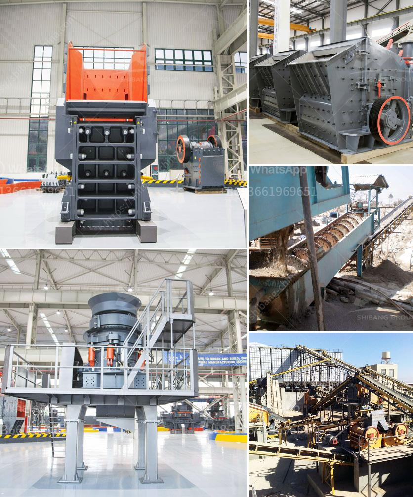

<h3>10 tph trally mounted stone crusher made in india</h3>
The stone crusher industry in India is witnessing the rise of a large number of local and international players. To cater to the ever-increasing demand for stone crushers, manufacturers are delivering high-end machines that offer maximum efficiency and unparalleled performance.

The trally mounted stone crusher is one such machine that has been developed through years of research and innovation. It is designed to offer users with a mobile and versatile solution that can work in the most demanding of conditions. With a capacity of 10 tph (tons per hour), this machine is highly efficient and ensures high productivity.

The trally mounted stone crusher comes with a unique feature that allows it to be easily transported and relocated anywhere in the job site. Its trally mounted design ensures that the machine can be moved from one location to another with minimal effort. This makes it ideal for construction sites where stone crushing tasks are carried out at multiple locations.

The machine is equipped with a robust jaw crusher that offers high crushing ratios and uniform product size distribution. This ensures that the stone crusher can handle various types of materials, including rocks, ores, and minerals. The trally mounted stone crusher is also equipped with an advanced control system that allows operators to adjust the crushing parameters to achieve the desired output.

In addition to its mobility and high crushing capacity, the trally mounted stone crusher is also known for its low operating costs. Its efficient engine and optimized crushing chamber design ensure low fuel consumption and reduced maintenance requirements. This translates into significant cost savings for operators, making the machine an attractive investment option.

The trally mounted stone crusher is made in India, showcasing the nation's engineering prowess in the field of construction machinery. Manufactured with utmost precision, this machine is made from high-quality materials, ensuring its durability and long service life. Its robust construction allows it to withstand the harshest of working conditions, making it suitable for use in various industries.

With 300-500 words, it is easy to see why the trally mounted stone crusher has gained popularity in the Indian market. Its ability to deliver high productivity, low operating costs, and easy transportation make it a preferred choice among contractors and construction companies. By investing in this machine, operators can ensure that their stone crushing operations are carried out efficiently and effectively.

In conclusion, the trally mounted stone crusher is a highly efficient and versatile machine that offers maximum productivity and performance. Its mobile design allows easy transportation and relocation, while its robust construction ensures durability and low operating costs. Made in India, this machine showcases the nation's engineering prowess and is a testament to the country's commitment to innovation in the construction machinery sector. With its impressive features and capabilities, the trally mounted stone crusher is set to revolutionize the stone crushing industry in India and beyond.
<h3>Contact us</h3><ul><li><strong>Whatsapp:&nbsp;<a href="https://wa.me/8613661969651">+8613661969651</a></strong></li><li><a href="https://swt.shibang-china.com/?git&amp;zhl&amp;10 tph trally mounted stone crusher made in india"><strong>Online Service(chat now)</strong></a></li></ul><h3>Related</h3><ul><li><a href='conveyor belt manufacturers in bangladesh.md'>conveyor belt manufacturers in bangladesh</a></li><li><a href='200 tph crusher plant.md'>200 tph crusher plant</a></li><li><a href='diamond mining equipment.md'>diamond mining equipment</a></li><li><a href='gypsum recycling plant cost.md'>gypsum recycling plant cost</a></li><li><a href='lime and dolomite plant in india.md'>lime and dolomite plant in india</a></li></ul>