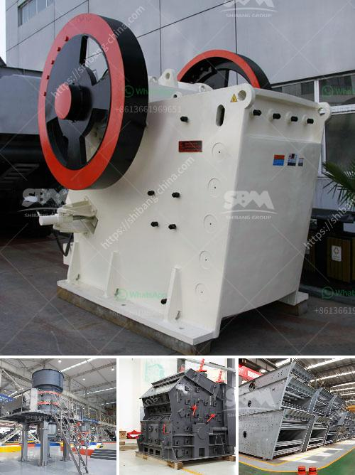

<h3>100 ton per day cement making plant</h3>
A cement making plant that can produce 100 tons of cement per day is a significant investment, requiring substantial planning and execution. These plants play a crucial role in the construction industry as cement is a key ingredient in various construction materials, such as concrete, mortar, and plaster.

One of the main components of a cement plant is a rotary kiln, which is responsible for heating limestone and other raw materials to temperatures exceeding 1400 degrees Celsius. This process, known as calcination, leads to the formation of clinker, a granular material that is then ground into cement powder. The rotary kiln typically has a long cylindrical structure and is lined with heat-resistant bricks to withstand the high temperatures and chemical reactions involved.

In addition to the rotary kiln, a cement plant consists of other essential equipment. These include crushers, which reduce large rocks into smaller sizes, and ball mills, which finely grind the clinker into cement powder. Storage silos are used to store the final product, while conveyors and transport vehicles ensure the efficient movement of materials within the plant.

The production capacity of 100 tons per day suggests a medium-sized cement plant, capable of supplying regional markets with a steady flow of cement. This scale of production requires rigorous quality control processes to ensure consistent and reliable products. The plant also needs to comply with environmental regulations to minimize its impact on the surrounding area, such as proper dust control and waste management.

Not only does a cement plant of this scale provide a vital construction material, but it also generates employment opportunities. A plant of this size would typically employ a significant number of workers, including engineers, technicians, operators, and laborers. These jobs contribute to the local economy and provide livelihoods for individuals and their families.

Moreover, investing in a cement plant allows for local production and reduces reliance on imports. It promotes self-sufficiency in the construction sector and reduces transportation costs associated with importing cement from distant locations. This, in turn, can help lower construction costs, making infrastructure development more affordable and more accessible.

Expanding the production capacity from 100 tons per day to meet the demand requires careful planning. Additional equipment, such as larger crushers or additional production lines, may be necessary. This expansion needs to factor in market demand projections and financial analysis to ensure the investment is viable in the long run.

In conclusion, a 100-ton per day cement making plant is a significant venture that requires meticulous planning, execution, and adherence to quality and environmental standards. It plays a vital role in the construction industry, generating employment opportunities and promoting self-sufficiency. The expansion of such a plant should be carefully considered, taking into account market demand and long-term viability.
<h3>Contact us</h3><ul><li><strong>Whatsapp:&nbsp;<a href="https://wa.me/8613661969651">+8613661969651</a></strong></li><li><a href="https://swt.shibang-china.com/?git&amp;zhl&amp;100 ton per day cement making plant"><strong>Online Service(chat now)</strong></a></li></ul><h3>Related</h3><ul><li><a href='10 tph trally mounted stone crusher made in india.md'>10 tph trally mounted stone crusher made in india</a></li><li><a href='primary crusher ball milling pengertian.md'>primary crusher ball milling pengertian</a></li><li><a href='small stone crusher in kenya.md'>small stone crusher in kenya</a></li><li><a href='raymond mill china.md'>raymond mill china</a></li><li><a href='pebble crushing production line.md'>pebble crushing production line</a></li></ul>