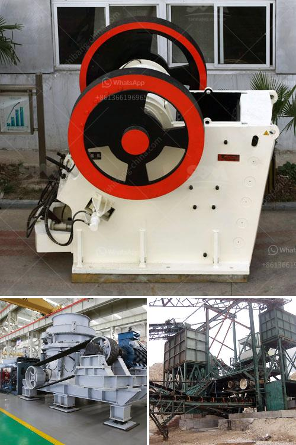

<h3>100tph stationery stone crushing plant</h3>
The stone crushing plant is a versatile and efficient machine that is widely used to crush stones of different sizes. This eventful machine can efficiently crush and screen gravels, crushed stones and rocks of varying hardness to meet different project requirements and ensure optimum productivity. 

A 100tph stationery stone crushing plant is a perfect choice for contractors who are looking for a reliable and efficient crusher for their medium-scale projects. This plant can crush and screen various materials such as limestone, marble, granite, basalt, river stone, and so on to produce sand and gravels for construction purposes. 

One of the most attractive features of this stone crushing plant is its high automation level. The plant is equipped with advanced electrical control system that greatly improves the automation level of the entire production line. It enables operators to easily control and monitor the crushing process, reducing labor costs and enhancing efficiency. 

Another noteworthy advantage of the 100tph stationery stone crushing plant is its simple and compact design. The plant is designed in a way that it occupies minimum space while ensuring maximum productivity. Its compact size makes it easy to transport and install, thus saving time and cost for the contractors. 

The plant is also equipped with high-quality crushers and screens that offer excellent performance and durability. The crushers are specifically designed to handle various types of stones with different hardness levels and reduce them to desired sizes. The screens efficiently separate the crushed stones into different sizes for targeted use in various construction projects. 

In conclusion, a 100tph stationery stone crushing plant is a reliable choice for contractors who are seeking a versatile and efficient crusher for their medium-scale projects. With its high automation level, simple design, and excellent performance, this plant ensures optimum productivity and profitability for the contractors. Whether it is used for infrastructure development, road construction, or any other construction projects, this stone crushing plant is definitely a valuable asset.
<h3>Contact us</h3><ul><li><strong>Whatsapp:&nbsp;<a href="https://wa.me/8613661969651">+8613661969651</a></strong></li><li><a href="https://swt.shibang-china.com/?git&amp;zhl&amp;100tph stationery stone crushing plant"><strong>Online Service(chat now)</strong></a></li></ul><h3>Related</h3><ul><li><a href='rock crusher in europe.md'>rock crusher in europe</a></li><li><a href='balls for ball mill in india.md'>balls for ball mill in india</a></li><li><a href='cost of cement grinding unit in india.md'>cost of cement grinding unit in india</a></li><li><a href='crushers of jaw china.md'>crushers of jaw china</a></li><li><a href='calcium carbonate milling machine.md'>calcium carbonate milling machine</a></li></ul>