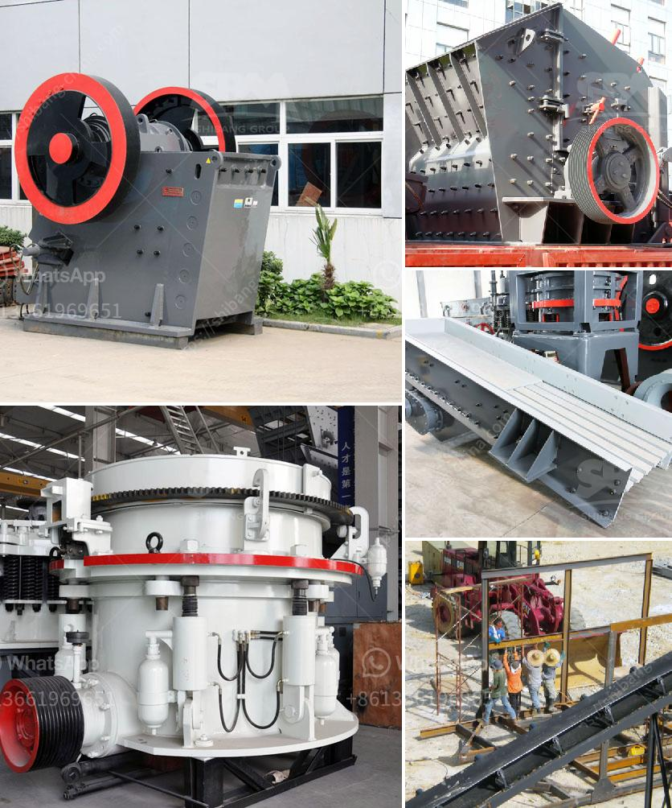

<h3>18 36 inch jaw crusher plant in south africa</h3>
The mining industry is one of the largest sectors in South Africa, contributing significantly to the country's economy. In this thriving industry, efficient and reliable crushing equipment is crucial to ensure continuous production. One such key equipment is the 18 36 inch jaw crusher plant, which is widely used in various mining operations.

The 18 36 inch jaw crusher plant is a versatile and efficient crushing machine that is capable of breaking down materials of varying hardness. It is commonly used for primary crushing applications, serving as a primary crusher for aggregate and ore processing plants. With its sturdy construction and high-quality components, this jaw crusher plant can withstand the demanding conditions of mining operations.

Featuring a jaw size of 18 by 36 inches, this plant can handle large rocks and deliver excellent output. It has a large feed opening, allowing it to process materials with a maximum size of 36 inches. The jaw crusher operates by exerting force on the material through a fixed jaw plate and a moving jaw plate. As the material enters the crushing chamber, it is crushed between the two plates, resulting in smaller particles that can be further processed or transported.

The 18 36 inch jaw crusher plant is designed to be highly efficient and productive. It is equipped with a powerful motor that enables it to deliver high crushing capacity. Additionally, it features a hydraulic system that ensures smooth and consistent operation. The plant is also equipped with various safety features to protect the operator and prevent accidents.

South Africa is a country rich in mineral resources, and the demand for crushing equipment is high. The 18 36 inch jaw crusher plant provides an excellent solution for the mining industry's crushing needs. Its robust construction, high productivity, and reliability make it a valuable asset in any mining operation. Whether used for primary crushing or secondary crushing, this jaw crusher plant delivers exceptional performance and contributes to the success of mining operations in South Africa.
<h3>Contact us</h3><ul><li><strong>Whatsapp:&nbsp;<a href="https://wa.me/8613661969651">+8613661969651</a></strong></li><li><a href="https://swt.shibang-china.com/?git&amp;zhl&amp;18 36 inch jaw crusher plant in south africa"><strong>Online Service(chat now)</strong></a></li></ul><h3>Related</h3><ul><li><a href='power of a roller mill.md'>power of a roller mill</a></li><li><a href='concrete recycling equipment manufacturers.md'>concrete recycling equipment manufacturers</a></li><li><a href='raymond grinding mill manufacturers in udaipur.md'>raymond grinding mill manufacturers in udaipur</a></li><li><a href='ball mill for limestone grinding power calculation.md'>ball mill for limestone grinding power calculation</a></li><li><a href='jaw crusher plant price.md'>jaw crusher plant price</a></li></ul>