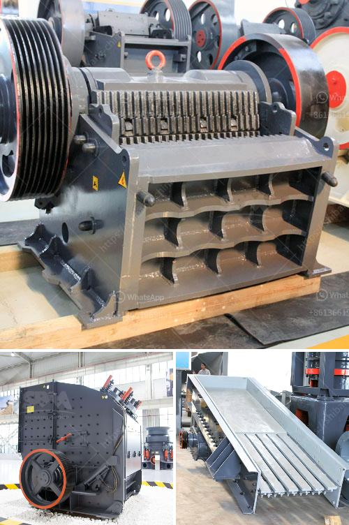

<h3>18tph roll mill process</h3>
The 18tph roll mill process is a crucial step in the production of various materials, including metals, plastics, and ceramics. This process involves feeding raw materials into a rolling mill machine, which then deforms and shapes them into the desired form.

The key feature of the 18tph roll mill process is its high throughput capacity. With a capacity of 18 tons per hour, this process can efficiently handle large quantities of materials, making it ideal for industrial-scale production. Whether it is steel sheets, plastic films, or ceramic tiles, the roll mill can quickly and precisely process them into the desired shape and size.

The roll mill process works by passing the raw materials between two rotating rollers. These rollers apply pressure and friction to the materials, causing them to deform and change shape. The gap between the rollers can be adjusted to control the thickness of the output material. This level of control allows manufacturers to produce materials with precise dimensions and specifications.

The advantages of the 18tph roll mill process are numerous. Firstly, it offers high productivity, allowing manufacturers to meet large orders with ease. Secondly, it provides consistency and uniformity in the final product, ensuring that each piece meets the required quality standards. Additionally, the roll mill process can be automated, reducing the need for manual labor and increasing overall efficiency.

In conclusion, the 18tph roll mill process is a highly efficient and productive method for shaping and transforming raw materials into finished products. With its high throughput capacity, precise control, and automation capabilities, this process is widely used in various industries. Whether it is for manufacturing steel, plastic, or ceramic products, the 18tph roll mill is an essential tool for modern production facilities.
<h3>Contact us</h3><ul><li><strong>Whatsapp:&nbsp;<a href="https://wa.me/8613661969651">+8613661969651</a></strong></li><li><a href="https://swt.shibang-china.com/?git&amp;zhl&amp;18tph roll mill process"><strong>Online Service(chat now)</strong></a></li></ul><h3>Related</h3><ul><li><a href='stone crusher suppliers in indore.md'>stone crusher suppliers in indore</a></li><li><a href='coal mining equipment coal mining equipment for sale.md'>coal mining equipment coal mining equipment for sale</a></li><li><a href='gyratory crusher price.md'>gyratory crusher price</a></li><li><a href='limestone powder conveying system.md'>limestone powder conveying system</a></li><li><a href='business plan for marble and granite factory pdf.md'>business plan for marble and granite factory pdf</a></li></ul>