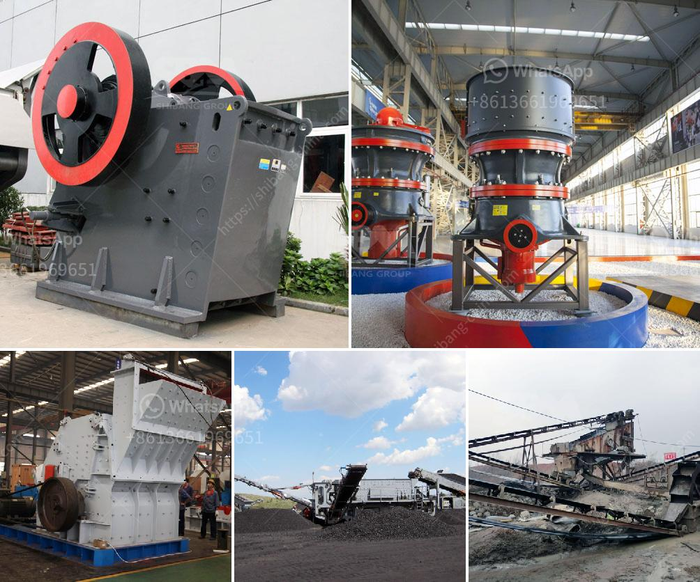

<h3>2 roll mill machine</h3>
In the field of manufacturing and production processes, having the right equipment is crucial to ensure efficiency, accuracy, and quality. One such machine that finds wide application in various industries is the two roll mill machine. This versatile equipment is widely used for mixing, refining, and compounding of different materials.

The two roll mill machine consists of two horizontal parallel rotating rolls encased in a sturdy frame. The rolls can be made of various materials such as cast iron, stainless steel, or even polymer materials. The distance between the rolls, known as the nip, can be adjusted according to the specific requirements of the process. This adjustable nip enables precise control over the thickness, uniformity, and texture of the material being processed.

One of the key advantages of the two roll mill machine is its ability to mix and refine materials uniformly. This makes it ideal for compounding various substances such as rubber, plastics, adhesives, and even food products. The rotating action of the rolls creates a shearing and kneading effect, ensuring thorough blending and dispersion of additives, fillers, and pigments. This results in a homogeneous mixture with enhanced properties and performance.

Moreover, the two roll mill machine offers excellent temperature control during processing. Heat transfer can be optimized by supplying cooling water or heating elements to the rolls, preventing material degradation or premature curing. This precise temperature management is crucial when working with temperature-sensitive materials such as thermoplastics or elastomers.

The compact design and straightforward operation of the two roll mill machine make it a valuable asset for small-scale and large-scale manufacturing facilities alike. Additionally, modern advancements have introduced automated features such as computerized controls and digital display systems, enhancing ease of use, and minimizing human error.

In conclusion, the two roll mill machine is an indispensable tool in various industries for its versatility, efficiency, and accuracy in material processing. Its ability to mix, refine, and compound different substances with uniformity and controlled temperature makes it invaluable. As manufacturing processes continue to evolve, the two roll mill machine remains a crucial companion in the pursuit of quality, consistency, and innovation.
<h3>Contact us</h3><ul><li><strong>Whatsapp:&nbsp;<a href="https://wa.me/8613661969651">+8613661969651</a></strong></li><li><a href="https://swt.shibang-china.com/?git&amp;zhl&amp;2 roll mill machine"><strong>Online Service(chat now)</strong></a></li></ul><h3>Related</h3><ul><li><a href='portable crushers.md'>portable crushers</a></li><li><a href='company in japan dealing in portable crusher machine.md'>company in japan dealing in portable crusher machine</a></li><li><a href='stone crusher 80 tons of jam.md'>stone crusher 80 tons of jam</a></li><li><a href='vertical mill operating principle.md'>vertical mill operating principle</a></li><li><a href='rotary dryer machine photo.md'>rotary dryer machine photo</a></li></ul>