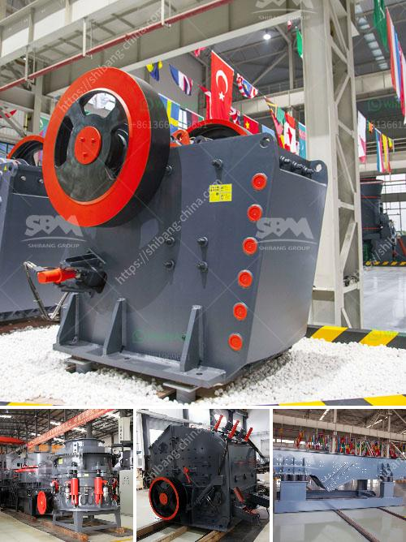

<h3>200 tph crusher plant</h3>
A crusher plant, or crushing plant, is a series of machines designed to break large rocks into smaller rocks, gravel, or rock dust. They are utilized by a variety of industries such as mining, construction, and recycling. These plants are typically found in quarries, where the stone is mined and processed into smaller sizes for various applications. One such plant is the 200 TPH crusher plant, also known as the 'conveyor impactor loop'.

This crusher plant consists of two separate components: a primary crusher and a secondary crusher, each with their own specifications and capabilities. The primary crusher is responsible for reducing the size of the stone, while the secondary crusher further breaks down the stone into sizes that can be processed by the tertiary crusher, or the screening plant.

The 200 TPH crusher plant is capable of processing a variety of materials, such as limestone, granite, basalt, and even river rock. The plant is well equipped with an advanced dust suppression system to reduce the dust generation. It also has a highly efficient hydraulic system, allowing for easy setup and maintenance.

With a capacity of 200 tph, this crusher plant meets the requirements of a wide range of applications and industries. It can produce high-quality aggregates for road construction, railway ballast, concrete, asphalt, and more. Additionally, the plant is highly mobile and can be transported to different locations for on-site crushing.

In conclusion, the 200 TPH crusher plant is a versatile and cost-effective solution for a variety of applications. It provides high-quality aggregates, reduces dust generation, and is equipped with advanced technology for easy setup and maintenance. Whether it is for mining, construction, or recycling, this plant ensures efficient and reliable crushing operations.
<h3>Contact us</h3><ul><li><strong>Whatsapp:&nbsp;<a href="https://wa.me/8613661969651">+8613661969651</a></strong></li><li><a href="https://swt.shibang-china.com/?git&amp;zhl&amp;200 tph crusher plant"><strong>Online Service(chat now)</strong></a></li></ul><h3>Related</h3><ul><li><a href='small rock crusher.md'>small rock crusher</a></li><li><a href='blast slag grinding machine india.md'>blast slag grinding machine india</a></li><li><a href='conveyor belt manufacturers in bangladesh.md'>conveyor belt manufacturers in bangladesh</a></li><li><a href='copper crusher machine.md'>copper crusher machine</a></li><li><a href='3 roller raymond mill delhi.md'>3 roller raymond mill delhi</a></li></ul>