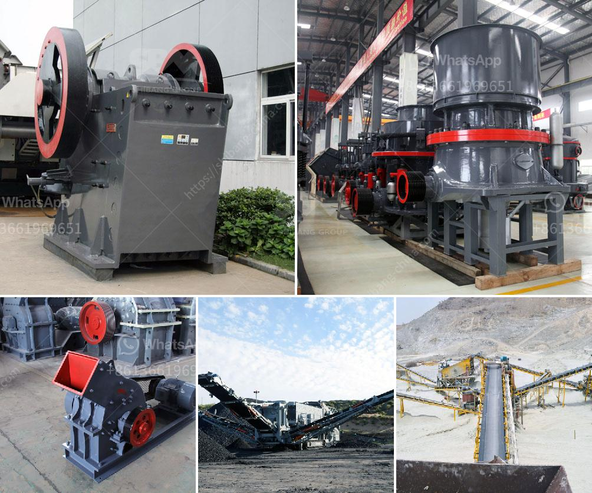

<h3>200tph mobile crusher prices used</h3>
The mobile crusher is a crushing device with better adaptability and mobility on the market. It can easily crush the gangue, coal slag, shale, coal cinder, and construction waste with high permeability. It has been widely used in the field of mining, coal mine, and construction waste recycling.

With the rapid expansion of the construction industry, the application scope of mobile crushers is also expanding fast. The emergence of mobile crushers has eliminated the need for transportation time and fundamentally solved the transportation problems of materials in the mining industry. It not only saves the user's transportation costs but also greatly improves the working efficiency of the field operation.

When investing in a mobile crusher, users need to choose a mobile crusher model with strong generality and high cost performance. And the 200tph mobile crusher prices used is a reasonable choice for improving productivity. The machine has various features, and advantages.

I. Among them, PEW250×1000 jaw crusher and HJ98 high-efficiency jaw crusher have strong adaptability to materials. The former can be used in models with feed opening sizes varying from 250mm to 1000mm, so that it can meet the needs of various mining, metallurgical, construction, water conservancy, chemical, and other infrastructure construction industries. The latter has a maximum feed size of 800mm, and the processing capacity is between 85 and 275t/h, making it a versatile model suitable for various applications.

II. The 200tph mobile crusher is composed of a crushing device, a feeding device, a screening device, and a conveying device. It is connected to the production line through the conveyor, which greatly improves the flexibility of the equipment and meets the needs of different mining sites, reducing the transportation cost of materials.

III. Over the years, the models of mobile crushers have undergone great changes. Now, the mobile crusher price is being affected by various factors such as the fluctuation of steel prices, labor costs, construction costs, etc. In order to solve these market uncertainties, many domestic equipment manufacturers have also increased the price of mobile crushers, but on the whole, there is still room for improvement.

IV. The price of 200tph mobile crusher is higher than that of ordinary crushing equipment, but because of its convenient movement and powerful adaptability, it takes higher investment cost to realize stable and efficient operation. The price of 200tph mobile crusher is the fearful factor most customers will consider, and at the same time, the price is related to the configuration and model of the mobile crusher. In conclusion, when manufacturers choose the mobile crusher, they should not only consider the price, but also pay attention to the performance, quality, and brand of the equipment.

In a word, the mobile crusher is worth recommending for its excellent performance and a favorable price. It is cost-effective and can meet various crushing needs, with remarkable economic and social benefits. For users who need to crush large quantities of materials and move frequently, the 200tph mobile crusher prices used is an ideal choice.
<h3>Contact us</h3><ul><li><strong>Whatsapp:&nbsp;<a href="https://wa.me/8613661969651">+8613661969651</a></strong></li><li><a href="https://swt.shibang-china.com/?git&amp;zhl&amp;200tph mobile crusher prices used"><strong>Online Service(chat now)</strong></a></li></ul><h3>Related</h3><ul><li><a href='used stone crusher for sale in dubai.md'>used stone crusher for sale in dubai</a></li><li><a href='3 roller raymond mill delhi.md'>3 roller raymond mill delhi</a></li><li><a href='stone cracher mechine manufacturer.md'>stone cracher mechine manufacturer</a></li><li><a href='calcite powder grinding mill sale.md'>calcite powder grinding mill sale</a></li><li><a href='quarry crusher philippines.md'>quarry crusher philippines</a></li></ul>