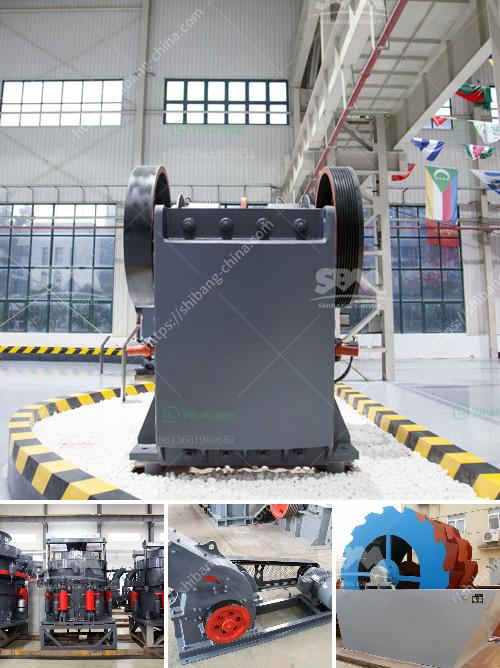

<h3>3 roller mill and new zealand</h3>
New Zealand is an idyllic nation known for its picturesque landscapes, diverse culture, and thriving industries. One such industry that plays a vital role in the country's economy is the manufacturing sector, which encompasses a wide range of products, including beverages, cosmetics, pharmaceuticals, and food items. Among the various tools and machinery used in this sector, the three roller mill stands out for its versatility and functionality. In this article, we explore the significance of three roller mills in the context of New Zealand and their contributions to the local manufacturing scene.

A three roller mill is a robust apparatus designed to efficiently crush, grind, or pulverize substances. It consists of three horizontally positioned rollers that rotate in opposite directions, exerting varying levels of pressure on the material fed into the mill. These machines are commonly utilized in the manufacturing industry for processes such as refining, homogenizing, and blending.

Within the food and beverage sector in New Zealand, three roller mills find extensive use. The grinding action of the rollers allows for the refinement of raw materials such as cereals, grains, and beans, resulting in improved texture, taste, and digestibility. In breweries, these mills are instrumental in malt extraction and crushing, facilitating efficient fermentation. Additionally, three roller mills are employed in the production of diverse culinary products, including chocolate, pastes, and sauces.

The pharmaceutical and cosmetics industries in New Zealand greatly benefit from the functionality of three roller mills. These mills enable the uniform and controlled dispersion of active ingredients into creams, ointments, and medicinal products. The precise grinding mechanism allows for consistent particle size reduction, ensuring the quality and effectiveness of the final product. Furthermore, three roller mills play a pivotal role in cosmetic manufacturing, enabling the production of finely ground powders, pigments, and foundations.

Three roller mills contribute to the overall efficiency and productivity of manufacturing processes in New Zealand. The advanced design and reliable operation of these mills minimize downtime, ensuring uninterrupted production. Moreover, the ability to adjust roller pressures and gap settings allows for precise control over particle size, resulting in consistent product quality. This versatility and fine-tuning capability make three roller mills indispensable tools within the manufacturing realm.

New Zealand has a strong commitment to sustainable manufacturing practices. Three roller mills align with this ideology by allowing for efficient use of resources. The controlled grinding process reduces waste, enhances yield, and lowers energy consumption. Additionally, by ensuring uniform particle size distribution, these mills optimize downstream processes such as mixing, resulting in minimal product loss and increased sustainability.

The diverse applications and undeniable benefits of three roller mills have established them as indispensable machinery in the manufacturing industry of New Zealand. These robust tools enable precise grinding, refining, and homogenization processes, offering consistent product quality and superior efficiency. With their contributions to the food and beverage, pharmaceutical, and cosmetics sectors, three roller mills play a critical role in enhancing manufacturing capabilities in the nation.
<h3>Contact us</h3><ul><li><strong>Whatsapp:&nbsp;<a href="https://wa.me/8613661969651">+8613661969651</a></strong></li><li><a href="https://swt.shibang-china.com/?git&amp;zhl&amp;3 roller mill and new zealand"><strong>Online Service(chat now)</strong></a></li></ul><h3>Related</h3><ul><li><a href='gypsum ball mill manufacturing machine.md'>gypsum ball mill manufacturing machine</a></li><li><a href='buy and sell conveyor belts in south africa.md'>buy and sell conveyor belts in south africa</a></li><li><a href='coal machinery for coal processing crusher.md'>coal machinery for coal processing crusher</a></li><li><a href='diesel stone crushers from germany.md'>diesel stone crushers from germany</a></li><li><a href='machinery for quartz stone.md'>machinery for quartz stone</a></li></ul>