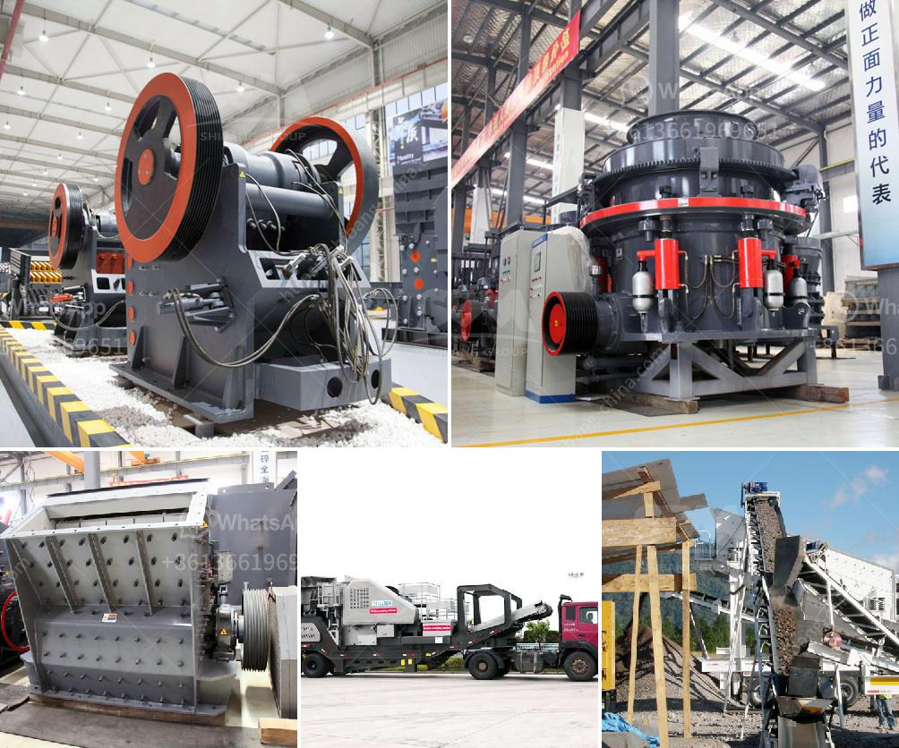

<h3>3 roller raymond mill delhi</h3>
The city of Delhi, known for its rich history and cultural heritage, has long been a hub of industrial and technological advancements. One such innovation that has revolutionized the manufacturing industry is the 3 roller Raymond mill. This state-of-the-art mill, also known as the Raymond Roller Mill, is an indispensable tool for the grinding of various minerals and materials. In this article, we shall explore the features and benefits of this mill.

The 3 roller Raymond mill is a multi-purpose grinding machine that simultaneously grinds, dries, and classifies materials. The unique design and operation of this mill allow for efficient grinding without the need for additional drying equipment. Additionally, the Raymond Roller Mill incorporates a forced turbine classifier, which ensures a consistent fineness of the ground material.

One of the primary advantages of the 3 roller Raymond mill is its high productivity. With its three roller design, this mill can efficiently grind large quantities of materials in a short span of time. This productivity is further enhanced by the integrated air circulation system, which helps in maintaining a cool operating temperature and prevents overheating, even during extended grinding sessions.

Another key advantage of the 3 roller Raymond mill is its versatility. This mill can handle a wide range of materials, including limestone, clay, bentonite, and various minerals. The adjustable settings of the mill allow for precise control over the fineness of the grind, making it suitable for a diverse range of applications. Whether you need fine powder for the production of paints or coarse particles for the manufacturing of cement, the Raymond Roller Mill can meet your requirements with ease.

The 3 roller Raymond mill is also known for its energy efficiency. The unique air circulation system, combined with the low power consumption of the roller mill, ensures minimal energy wastage during the grinding process. This not only reduces operational costs but also makes the mill environmentally friendly.

Furthermore, the 3 roller Raymond mill is designed for ease of maintenance. The rollers can be easily replaced, ensuring uninterrupted operation and minimal downtime. The mill also features a robust construction, which ensures its durability and longevity. With proper maintenance and regular servicing, the mill can continue to deliver exceptional performance for years to come.

In conclusion, the 3 roller Raymond mill is a highly efficient and versatile grinding machine that has transformed the manufacturing industry in Delhi. Its ability to grind, dry, and classify materials, along with its high productivity and energy efficiency, make it an indispensable tool for various applications. Whether you need fine powder or coarse particles, the Raymond Roller Mill can deliver the desired results with utmost precision. With its ease of maintenance and durability, this mill is a valuable asset for any manufacturing facility in Delhi and beyond.
<h3>Contact us</h3><ul><li><strong>Whatsapp:&nbsp;<a href="https://wa.me/8613661969651">+8613661969651</a></strong></li><li><a href="https://swt.shibang-china.com/?git&amp;zhl&amp;3 roller raymond mill delhi"><strong>Online Service(chat now)</strong></a></li></ul><h3>Related</h3><ul><li><a href='3 roller mill and new zealand.md'>3 roller mill and new zealand</a></li><li><a href='jaw crusher plant price.md'>jaw crusher plant price</a></li><li><a href='chinese stone crusher machine.md'>chinese stone crusher machine</a></li><li><a href='slag peralatan pabrik vertikal.md'>slag peralatan pabrik vertikal</a></li><li><a href='gravel crushing machine.md'>gravel crushing machine</a></li></ul>