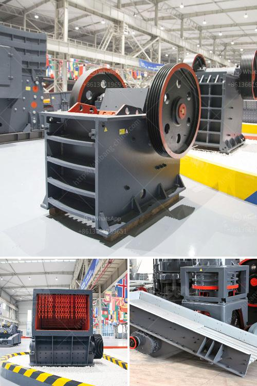

<h3>300 tone per hour limestone crusher</h3>
A crusher is a machine designed to reduce large rocks into smaller rocks, gravel, or rock dust. In today’s scenario, most of the limestone quarries are opting for a mobile limestone crusher because of its mobility factor. Mobile limestone crusher, also called mobile limestone crushing plant, is a star product of Fote.

Equipped with the unit configuration, Fote’s mobile limestone crusher adopts the latest manufacturing technology, high-quality chrome blow bar and wear-resisting counterattack linings. With high crushing ratio, Fote’s mobile limestone crushers can ensure a good particle shape. For those mining investors who have a complicated working site conditions, this type of mobile limestone crusher can be regarded as an ideal stone crusher.

Since this limestone crusher is easily movable and easy to install, it has been rapidly attracted by the mining industry. Especially the mobile limestone crushing plant, greatly simplified the production process, reduced investment costs, and also improved the granularity of the crushed materials. In order to meet the requirements of different users, Fote Machinery has developed a variety of conditions, rich models of mobile limestone crusher.

According to the user’s production needs, Fote Machinery will equip the limestone crushers with different specifications and models, and the limestone crusher price is also affected by the different technologies, regional differences, materials, and other factors. The large limestone crusher machine has a large crushing ratio and can reach a crushing ratio of 50 or more.

In order to ensure that the device can work in a high-efficiency state for a long time, the manufacturer of the limestone crusher must do a good job of regular maintenance. Many excellent manufacturers in the market have mature limestone crushing equipment maintenance programs, so that customers can rest assured that the use of crusher, to achieve the purpose of efficient crushing and improve the output of equipment.
<h3>Contact us</h3><ul><li><strong>Whatsapp:&nbsp;<a href="https://wa.me/8613661969651">+8613661969651</a></strong></li><li><a href="https://swt.shibang-china.com/?git&amp;zhl&amp;300 tone per hour limestone crusher"><strong>Online Service(chat now)</strong></a></li></ul><h3>Related</h3><ul><li><a href='komatsu crawler crusher.md'>komatsu crawler crusher</a></li><li><a href='jual jaw crusher bekas surabaya.md'>jual jaw crusher bekas surabaya</a></li><li><a href='grinding mill of cerial in ethiopia.md'>grinding mill of cerial in ethiopia</a></li><li><a href='stone crusher company russia.md'>stone crusher company russia</a></li><li><a href='ball mill suppliers in hyderabad.md'>ball mill suppliers in hyderabad</a></li></ul>