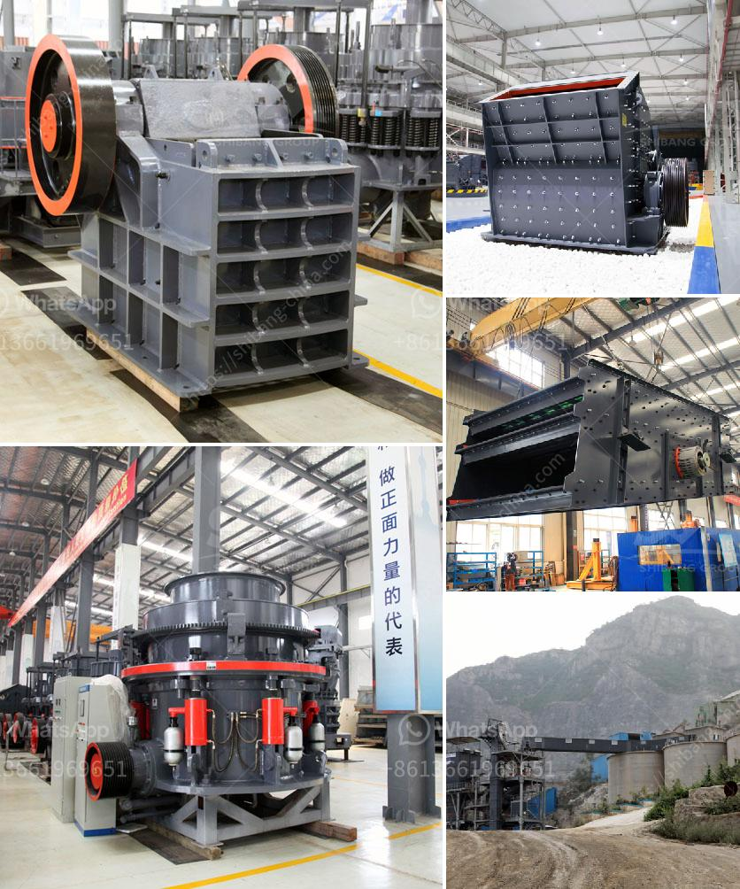

<h3>400 mesh grinding mill equipment</h3>
The grinding mill equipment is a professional pulverizer that meets the needs of 400 mesh fine powder production. This mill is a high-efficiency and energy-saving mill developed by Hongcheng. It provides professional ultra-fine grinding technology and is an advanced equipment in the field of fine powder processing. Hongcheng has always been a reliable grinding mill manufacturer with a good reputation and excellent equipment quality.

The 400 mesh grinding mill equipment is a device that realizes fine powder production and has a large production capacity. Hongcheng provides tailor-made services according to customer needs to help the project create value. What type of grinding mill equipment can be used to increase production capacity and grind 400 mesh ore powder? Hongcheng takes the customer as the center, understands the customer's grinding requirements, and provides tailor-made design and selection schemes.

The 400 mesh grinding mill equipment is an excellent equipment for fine powder grinding. It breaks through the problems of traditional milling and realizes large-scale production and optimized processing. Hongcheng mill sincerely looks forward to working with you to create a new generation of high-efficiency and low-consumption environmental protection grinding mill equipment. The steel ball media commonly used in 400 mesh grinding mills on the market can reduce the problem of ore viscosity and ensure the uniformity of the non-metallic mineral powder. The 400 mesh ball mill grinding equipment has a better effect and is more professional in handling fine powder. The advantage of the entire new generation of grinding mill equipment is that it has a wide range of grinding materials and is suitable for grinding a variety of materials such as limestone, marble, potassium feldspar, barite, dolomite, talc, activated carbon, bentonite, and magnesite.
<h3>Contact us</h3><ul><li><strong>Whatsapp:&nbsp;<a href="https://wa.me/8613661969651">+8613661969651</a></strong></li><li><a href="https://swt.shibang-china.com/?git&amp;zhl&amp;400 mesh grinding mill equipment"><strong>Online Service(chat now)</strong></a></li></ul><h3>Related</h3><ul><li><a href='crussher stone manufacturer in south africa.md'>crussher stone manufacturer in south africa</a></li><li><a href='rotary kiln cement plant cost in india.md'>rotary kiln cement plant cost in india</a></li><li><a href='coal powder making machine.md'>coal powder making machine</a></li><li><a href='turkey dolomite crushing plant.md'>turkey dolomite crushing plant</a></li><li><a href='stone crushing plant cost in pakistan.md'>stone crushing plant cost in pakistan</a></li></ul>