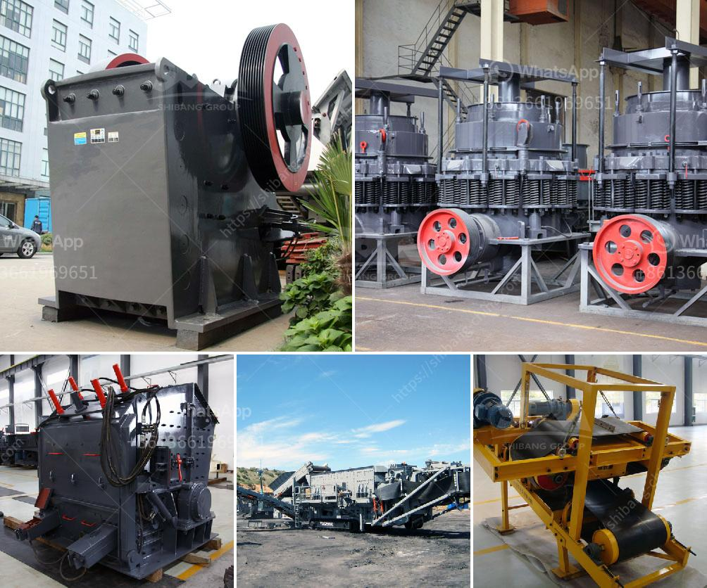

<h3>50 tpd cement plant manufacturer in china</h3>
A 50 TPD (tons per day) cement plant manufacturer in China is considered to be a small-scale cement production line. With the advanced technology, competitive price, and successful execution of projects, this cement plant manufacturer has become more and more popular among global investors.

This 50 TPD cement plant manufacturer offers a wide range of cement equipment, including vertical shaft kiln, cement ball mill, cement rotary kiln, cyclone preheater, grate cooler, etc. With the support of these advanced machines and state-of-the-art technology, this cement plant manufacturer ensures a high-quality and efficient production process.

One of the key advantages of this 50 TPD cement plant manufacturer is its competitive price. Compared to larger scale manufacturers, the cost of production and operation is relatively lower. This enables small-scale investors to establish their cement plants without facing excessive financial burdens.

Moreover, this cement plant manufacturer emphasizes the customization of equipment, allowing investors to tailor their production line according to their specific needs and requirements. The experienced engineering team provides design solutions suitable for different raw materials, fuel sources, and desired end products.

In addition to the design and production of cement equipment, this 50 TPD cement plant manufacturer also offers comprehensive after-sales service. The technical support team ensures smooth operation of the cement plant and provides guidance on maintenance and troubleshooting. This guarantees a reliable and long-lasting cement production line.

Overall, this 50 TPD cement plant manufacturer in China offers a cost-effective and tailor-made solution for small-scale cement production. With its advanced technology, competitive price, and excellent after-sales service, it has gained a solid reputation among investors worldwide. Whether establishing a new cement plant or expanding an existing one, this manufacturer is a reliable partner to achieve success in the cement industry.
<h3>Contact us</h3><ul><li><strong>Whatsapp:&nbsp;<a href="https://wa.me/8613661969651">+8613661969651</a></strong></li><li><a href="https://swt.shibang-china.com/?git&amp;zhl&amp;50 tpd cement plant manufacturer in china"><strong>Online Service(chat now)</strong></a></li></ul><h3>Related</h3><ul><li><a href='start a quarry plant.md'>start a quarry plant</a></li><li><a href='kaolin grinding plant manufacturer in india.md'>kaolin grinding plant manufacturer in india</a></li><li><a href='brick factory for sale in uk.md'>brick factory for sale in uk</a></li><li><a href='jaw crusher engine and complete set.md'>jaw crusher engine and complete set</a></li><li><a href='how to charge grinding media in ball mill.md'>how to charge grinding media in ball mill</a></li></ul>