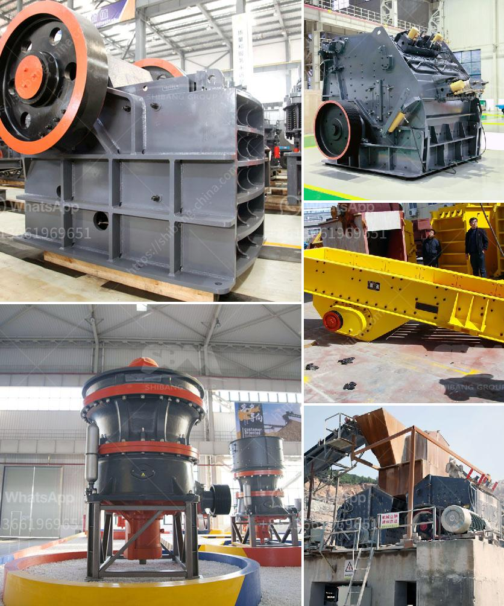

<h3>50 tpd mini cement plant task cost in india</h3>
A 50 TPD mini cement plant task cost in India refers to the establishment of a cement plant that produces 50 tons of cement per day. However, the cost of establishing such a plant can vary widely depending on numerous factors such as the specific location of the plant, the availability and cost of raw materials, the cost of labor, the cost of energy and other utilities, and the taxes and regulations imposed by the local government.

The task cost of setting up a 50 TPD mini cement plant in India can range from about $3,000 to $8,000 per ton of cement, depending on various factors. A 50 TPD mini cement plant task cost in India might be slightly higher than that of a 50 TPD rotary kiln cement plant due to the additional costs of storage, handling, and conveying equipment.

To establish a 50 TPD mini cement plant in India, the first step would be to acquire the necessary land for the plant's construction. The cost of land can vary significantly depending on the location and availability of land in the desired area.

Next, the plant would require various machinery and equipment such as crushers, mills, kilns, conveyors, and storage facilities. The cost of these machinery and equipment can vary based on the design and quality chosen by the investor.

The procurement of raw materials such as limestone, clay, and gypsum would be another significant cost for a 50 TPD mini cement plant. The cost of these raw materials can differ depending on their availability and proximity to the plant.

Additionally, the cost of labor, energy, and other utilities would need to be considered while estimating the task cost of setting up a 50 TPD mini cement plant in India.

Finally, the taxes and regulations imposed by the local government would also impact the overall cost. It is essential to obtain all necessary permits and comply with regulations to avoid any delays or penalties.

In conclusion, the task cost of setting up a 50 TPD mini cement plant in India can vary significantly depending on various factors. It is crucial for investors to conduct thorough research and feasibility studies to determine the most accurate cost estimates for their specific project.
<h3>Contact us</h3><ul><li><strong>Whatsapp:&nbsp;<a href="https://wa.me/8613661969651">+8613661969651</a></strong></li><li><a href="https://swt.shibang-china.com/?git&amp;zhl&amp;50 tpd mini cement plant task cost in india"><strong>Online Service(chat now)</strong></a></li></ul><h3>Related</h3><ul><li><a href='coal vibration equipment size.md'>coal vibration equipment size</a></li><li><a href='gyratory crusher price.md'>gyratory crusher price</a></li><li><a href='crushing plant working.md'>crushing plant working</a></li><li><a href='gold wash plant for sale in brazil.md'>gold wash plant for sale in brazil</a></li><li><a href='jaw crusher buatan philippines 250 ton hari.md'>jaw crusher buatan philippines 250 ton hari</a></li></ul>