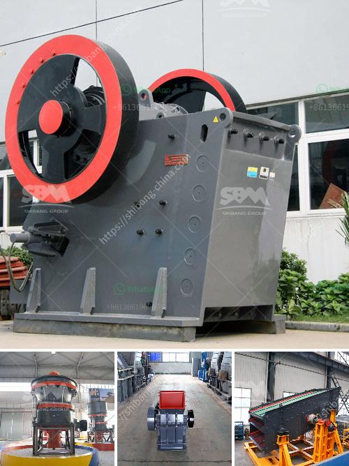

<h3>7x8 foot ball mills</h3>
Ball mills are essential equipment in mining and mineral processing operations. They are used to pulverize large ore pieces into smaller particles for further processing. One popular type of ball mill is the 7x8 foot ball mill, which offers a versatile grinding solution for various mining applications.

The 7x8 foot ball mill, also known as a drum mill, operates by rotating a cylinder with grinding media (such as steel balls) inside. As the cylinder rotates, the balls tumble and cascade, crushing the ore into fine particles. The grinding action is efficient, ensuring maximum contact between the grinding media and the ore, resulting in effective comminution.

One advantage of the 7x8 foot ball mill is its size. With dimensions of 7 feet in diameter and 8 feet in length, it offers a compact and space-saving design for mining operations. This size is suitable for small to medium-scale mining operations, where floor space may be limited but productive grinding is still required. Moreover, its manageable size allows for easy installation and maintenance.

The 7x8 foot ball mill is also known for its versatility. It can handle a wide range of ore types and hardness levels, making it suitable for various applications. Whether processing hard and abrasive ores or softer materials, this type of ball mill can effectively grind them down to the desired size. Operators can adjust the mill's speed, feed rate, and grinding media size to optimize the grinding process and achieve the desired particle size distribution.

Furthermore, the 7x8 foot ball mill offers flexibility in terms of operating conditions. It can be operated wet or dry, depending on the specific requirements of the application. Wet grinding is ideal for ore slurries, enhancing the grinding efficiency and reducing dust generation. Dry grinding, on the other hand, is suitable for materials that are sensitive to moisture or when the process requires a dry final product.

Maintenance of a 7x8 foot ball mill is relatively straightforward. Regular inspections and lubrication ensure optimal performance and extend the equipment's lifespan. The mill's components, such as liners and grinding media, may require periodic replacement, but these standard maintenance tasks are manageable and cost-effective.

In conclusion, the 7x8 foot ball mill is a versatile and efficient grinding solution for mining operations. Its compact size, versatility, and ease of maintenance make it suitable for various applications, from small-scale mining operations to larger plants. Whether grinding hard ore or softer materials, the 7x8 foot ball mill provides efficient and effective comminution, enabling mineral processing operations to achieve the desired particle size distribution.
<h3>Contact us</h3><ul><li><strong>Whatsapp:&nbsp;<a href="https://wa.me/8613661969651">+8613661969651</a></strong></li><li><a href="https://swt.shibang-china.com/?git&amp;zhl&amp;7x8 foot ball mills"><strong>Online Service(chat now)</strong></a></li></ul><h3>Related</h3><ul><li><a href='stone crusher conveyor belts.md'>stone crusher conveyor belts</a></li><li><a href='gypsum powder price in south africa.md'>gypsum powder price in south africa</a></li><li><a href='sand washing screener florida.md'>sand washing screener florida</a></li><li><a href='coal washing machines.md'>coal washing machines</a></li><li><a href='rotary dryer machine photo.md'>rotary dryer machine photo</a></li></ul>