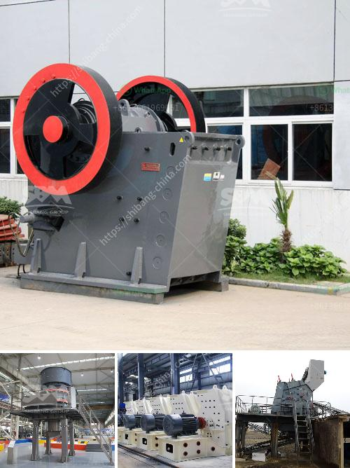

<h3>8 kw hammer mill</h3>
The 8 kW hammer mill is a versatile and powerful machine used in various industries for grinding and crushing different materials. With its robust construction and efficient operation, this equipment has become indispensable in many production processes.

One of the key features of the 8 kW hammer mill is its high energy efficiency. The powerful motor, with a power rating of 8 kW, ensures the machine delivers high levels of performance while consuming low amounts of energy. This makes it an economical choice for businesses looking to minimize their energy costs without compromising on productivity.

Another advantage of this hammer mill is its versatility. It can handle a wide range of materials, including grains, wood chips, straw, and even biomass pellets. This flexibility makes it highly suitable for use in industries such as agriculture, animal feed production, and biomass pellet manufacturing.

In addition to its versatility, the 8 kW hammer mill is also known for its exceptional grinding capacity. Its robust design and heavy-duty construction enable it to crush and grind large quantities of material quickly and efficiently. This ensures high production rates and minimizes downtime, resulting in increased productivity for the user.

The hammer mill's design incorporates several features that enhance its performance and ensure optimal results. These include a carefully balanced rotor that minimizes vibration, a replaceable screen that allows for easy adjustments to achieve the desired particle size, and a high-speed hammer arrangement that maximizes impact force.

Maintenance and operation of the 8 kW hammer mill are also relatively simple. The machine is equipped with easily accessible components, making routine maintenance tasks such as screen changes and hammer replacement quick and hassle-free. Furthermore, its user-friendly interface and intuitive controls make operation straightforward, even for inexperienced operators.

When it comes to safety, the 8 kW hammer mill has been designed with utmost consideration. It features multiple safety mechanisms, including an emergency stop button and safety guards, to ensure the protection of both the user and the machine during operation.

In conclusion, the 8 kW hammer mill is a reliable and efficient machine that offers numerous advantages for various industries. Its high energy efficiency and versatility make it a cost-effective choice, while its robust construction and exceptional grinding capacity ensure optimal performance and productivity. With its ease of maintenance and operation, as well as its focus on safety, this hammer mill is a reliable and valuable asset for businesses looking to enhance their production processes.

Overall, the 8 kW hammer mill is a valuable investment for businesses seeking a powerful and versatile grinding machine that delivers high performance and consistent results.
<h3>Contact us</h3><ul><li><strong>Whatsapp:&nbsp;<a href="https://wa.me/8613661969651">+8613661969651</a></strong></li><li><a href="https://swt.shibang-china.com/?git&amp;zhl&amp;8 kw hammer mill"><strong>Online Service(chat now)</strong></a></li></ul><h3>Related</h3><ul><li><a href='crusher stone machine price.md'>crusher stone machine price</a></li><li><a href='vertical grinder for spindle.md'>vertical grinder for spindle</a></li><li><a href='caco3 plant parts.md'>caco3 plant parts</a></li><li><a href='buy stone crusher machine in saudi arabia.md'>buy stone crusher machine in saudi arabia</a></li><li><a href='feldspar raymond mill grinding mill in low price.md'>feldspar raymond mill grinding mill in low price</a></li></ul>