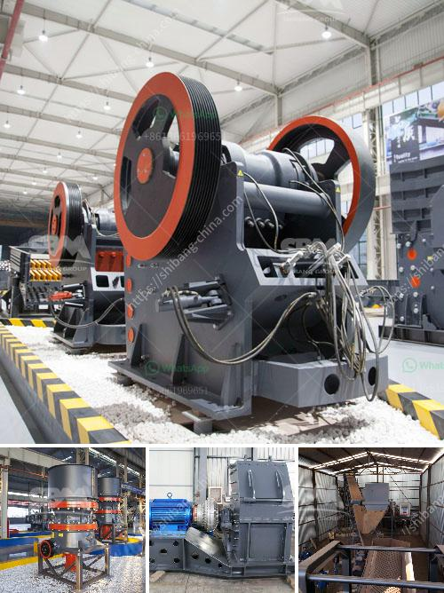

<h3>accessories for chia conveyor belts</h3>
Conveyor belts are an essential component of modern industries, ensuring goods and materials are efficiently transported throughout various production processes. While they are versatile and reliable, conveyor belts can be further enhanced with specific accessories to optimize their performance. This article explores the accessories available for chia conveyor belts, highlighting the importance of each and how they can significantly improve efficiency and productivity.

Chia seeds are small and delicate, making them prone to spillage and accumulation in the conveyor system. This build-up can not only cause blockages but also lead to contamination and product wastage. Belt cleaners are a critical accessory designed to remove debris, dust, and spillage from the belt's surface. By ensuring a clean belt, chia seeds can be transported efficiently without the risk of contamination or disruption in the production line.

Chia seeds, like many other small grains and seeds, have a tendency to escape from the sides of the conveyor belt. This can be problematic as it may result in loss of product and can cause damage to the machinery. Conveyor skirting is an accessory that provides a barrier along the edges of the belt, preventing spillage and keeping chia seeds on the intended path. This accessory not only reduces product loss but also contributes to maintaining a clean and organized work environment.

Chia conveyor belts must stay in proper alignment to avoid disruptions and ensure smooth operation. Tracking systems are designed to monitor the belt's position and make adjustments as necessary. These accessories can detect any misalignment or deviation from the desired path, automatically realigning the belt to prevent jams or damage to the machinery. By keeping the belt on track, tracking systems enhance efficiency, reduce downtime, and extend the lifespan of the conveyor system.

In cases where maintenance or repair is required, belt fasteners are essential accessories for chia conveyor belts. These small but crucial items hold together the ends of the belt, enabling quick and secure connections. Whether it is replacing a damaged section or installing a new belt, belt fasteners simplify the process, saving time and ensuring minimal disruption to the production line.

Conveyor belts can produce significant vibrations and noise, especially when operating at high speeds or carrying heavy loads. These factors can impact worker comfort and safety, as well as create an unpleasant work environment. Accessories such as vibration-dampening mounts and noise-reducing pads can be employed to mitigate these issues. By providing stability and absorbing vibrations, these accessories not only enhance productivity but also contribute to a more comfortable and ergonomically sound workplace.

In conclusion, chia conveyor belts can be further optimized with various accessories. Belt cleaners, conveyor skirting, tracking systems, belt fasteners, and vibration and noise control solutions all play essential roles in enhancing efficiency, minimizing product loss, reducing downtime, and ensuring a safe working environment. By investing in these accessories, industries can unlock the full potential of their conveyor systems, streamlining operations and ultimately improving overall productivity and profitability.
<h3>Contact us</h3><ul><li><strong>Whatsapp:&nbsp;<a href="https://wa.me/8613661969651">+8613661969651</a></strong></li><li><a href="https://swt.shibang-china.com/?git&amp;zhl&amp;accessories for chia conveyor belts"><strong>Online Service(chat now)</strong></a></li></ul><h3>Related</h3><ul><li><a href='chilli powder making machine india price.md'>chilli powder making machine india price</a></li><li><a href='stone crushers in cali.md'>stone crushers in cali</a></li><li><a href='feldspar raymond mill grinding mill in low price.md'>feldspar raymond mill grinding mill in low price</a></li><li><a href='gravel crusher machinery.md'>gravel crusher machinery</a></li><li><a href='raymond vertical mill product size 3 30 micron.md'>raymond vertical mill product size 3 30 micron</a></li></ul>