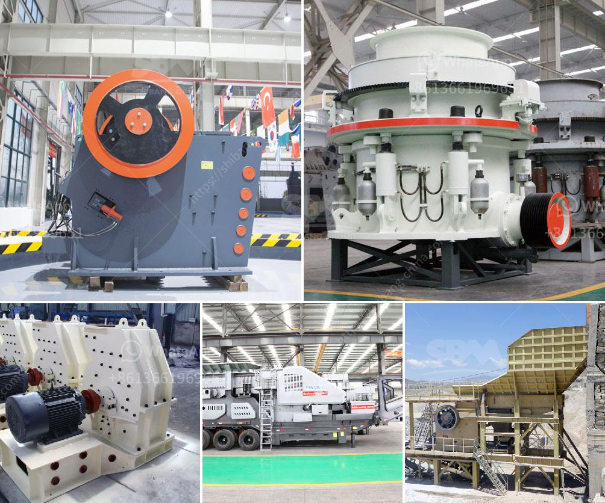

<h3>activated carbon crushing machine czech republic</h3>
Activated carbon is a versatile material used in various industries for its exceptional adsorption properties. It is widely employed in water treatment, air purification, and the production of numerous consumer products, including pharmaceuticals, cosmetics, and food and beverage products. As the demand for activated carbon continues to rise, so does the need for efficient and reliable machinery to process it. This is where the activated carbon crushing machine Czech Republic comes into play.

The activated carbon crushing machine, also known as the double roller crusher, is specially designed for crushing activated carbon material into fine powders or granules. It is a vital equipment in the mining industry, widely used in secondary or tertiary crushing production lines. The processed activated carbon particles produced by the crushing machine have high density and uniform shape, facilitating the efficient adsorption of gases and liquids. Consequently, they have a broad range of applications.

One notable feature of the activated carbon crushing machine Czech Republic is its advanced structure. The machine is mainly composed of a mainframe, a crushing chamber, an electric motor, a vibrating feeder, a vibrating screen, and a belt conveyor. Its design and structure ensure minimal energy consumption and low noise during operation. This is crucial as it allows for the running of the machine in various settings without causing disturbances or unnecessary environmental pollution.

Another key aspect of the activated carbon crushing machine Czech Republic is its reliability and durability. The machine is engineered using high-quality materials and components, ensuring its long-term performance and resistance to wear and tear. This is especially important considering the rigorous nature of the crushing process and the abrasive qualities of activated carbon particles. As a result, this crushing machine requires minimal maintenance, reducing operational costs and maximizing productivity.

The activated carbon crushing machine Czech Republic is also equipped with safety features to protect operators and prevent accidents. For instance, it is fitted with a safety shield that covers the crushing chamber, preventing accidental contact with moving parts. Additionally, the machine is equipped with an emergency stop button for immediate shutdown in case of emergencies. These safety measures ensure the well-being of machine operators and safeguard the overall workplace environment.

In conclusion, the activated carbon crushing machine Czech Republic plays a crucial role in the activation and processing of activated carbon materials. Its advanced design, reliable performance, and safety features make it a valuable asset for industries that rely on activated carbon for various applications. With the increasing demand for activated carbon, having a high-quality and efficient crushing machine becomes essential. The activated carbon crushing machine Czech Republic is a reliable and durable solution that meets these requirements, aiding the smooth operation of industrial processes while ensuring the safety of operators.
<h3>Contact us</h3><ul><li><strong>Whatsapp:&nbsp;<a href="https://wa.me/8613661969651">+8613661969651</a></strong></li><li><a href="https://swt.shibang-china.com/?git&amp;zhl&amp;activated carbon crushing machine czech republic"><strong>Online Service(chat now)</strong></a></li></ul><h3>Related</h3><ul><li><a href='manufacturing process of talcum powder.md'>manufacturing process of talcum powder</a></li><li><a href='precipitated calcium carbonate production plant design.md'>precipitated calcium carbonate production plant design</a></li><li><a href='lime stone pulverizer machine manufacturers.md'>lime stone pulverizer machine manufacturers</a></li><li><a href='quartz plass grinder price.md'>quartz plass grinder price</a></li><li><a href='calcite powder grinding mill sale.md'>calcite powder grinding mill sale</a></li></ul>