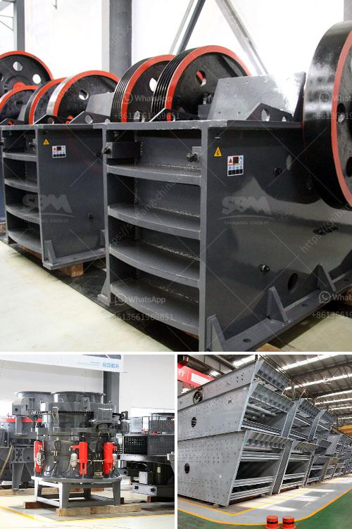

<h3>advantage and disadvantage of jaw crusher</h3>
Jaw crusher is an ancient crushing equipment through continuous optimization and improvement, jaw crusher has incomparable advantages. In the big family of crushers, jaw crushers are widely used in the market due to their excellent performance. Advantages such as high efficiency, low cost, reliable operation, and easy maintenance have helped jaw crushers to become the preferred choice for crushing operations. However, every coin has two sides, and jaw crushers are no exception.

1. High efficiency: The jaw crusher adopts the deep V-shaped crushing cavity design, which optimizes the crushing stroke, improves the crushing ratio and productivity, and reduces the needle-like particles.

2. Good stability and reliability: The jaw crusher adopts integrated motor installation design, which reduces the installation space of the equipment and eliminates the complex infrastructure work of the split components, making it more convenient for transition and transportation.

3. Convenient maintenance: The jaw crusher has a simple structure, reliable operation, and low operating costs. The material from the feed port enters the crushing cavity and is crushed between the fixed jaw plate and the movable jaw plate, and then discharged through the discharge port, which makes maintenance and repair more convenient.

4. Wide range of applications: The jaw crusher can handle a variety of materials, such as granite, marble, basalt, limestone, quartz stone, river pebble, iron ore, copper ore, and so on. Different materials have different processing characteristics, ensuring that the jaw crusher can meet the requirements of different applications.

1. High energy consumption: Although the jaw crusher has higher operational costs due to the crushing of materials, it consumes less energy when crushing rocks. Moreover, its long service life reduces its replacement frequency, thereby saving energy consumption.

2. Uneven particle size: The jaw crusher only crushes large pieces of material by squeezing and cannot evenly crush small materials. The crushing ratio is generally 6-8, and the impact crusher is suitable for the reduction ratio of 10-20.

3. Poor sealing: The jaw crusher is not sealed well, resulting in large dust. In addition, the noise pollution during the operation is relatively high, resulting in serious land pollution.

In conclusion, jaw crushers have both advantages and disadvantages. They are a popular crushing equipment in the mining industry due to their high efficiency, low cost, reliable operation, and easy maintenance. However, they also have limitations and drawbacks that need to be considered. It is essential to choose the appropriate type, model, and specification of the jaw crusher according to the specific requirements of the project. Additionally, the correct operation and maintenance of the jaw crusher are crucial to maximizing its advantages and minimizing the disadvantages.
<h3>Contact us</h3><ul><li><strong>Whatsapp:&nbsp;<a href="https://wa.me/8613661969651">+8613661969651</a></strong></li><li><a href="https://swt.shibang-china.com/?git&amp;zhl&amp;advantage and disadvantage of jaw crusher"><strong>Online Service(chat now)</strong></a></li></ul><h3>Related</h3><ul><li><a href='hammer mills for granite.md'>hammer mills for granite</a></li><li><a href='screening machine for sale south africa.md'>screening machine for sale south africa</a></li><li><a href='india edible clay making process.md'>india edible clay making process</a></li><li><a href='rubble crushing machine.md'>rubble crushing machine</a></li><li><a href='rotary dryer machine photo.md'>rotary dryer machine photo</a></li></ul>