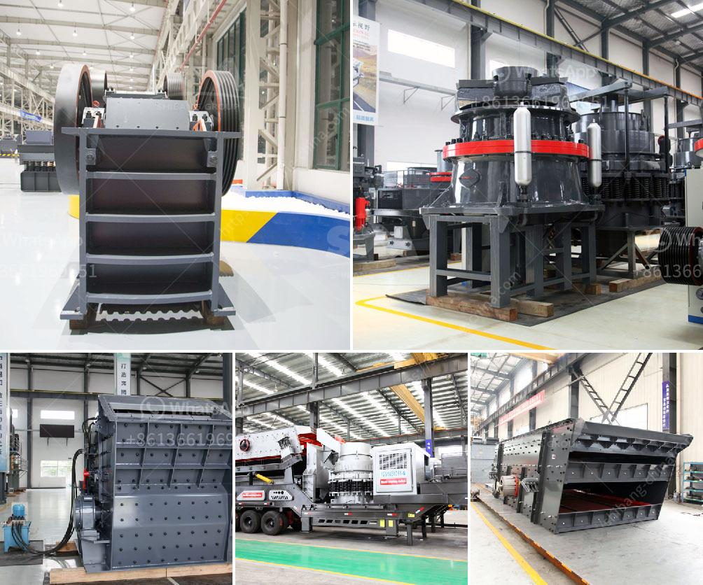

<h3>aggregate production line</h3>
Aggregate production line refers to the complete process of crushing, screening, washing and sorting rocks and minerals for the construction industry. Aggregate production line is used for producing artificial sand and pebble for various applications including concrete, cement, road, and bridge construction. With the increasing demand for quality aggregates, it has become essential to have a well-designed and efficient aggregate production line.

The first step in the aggregate production line is the extraction of raw materials from the quarry. These raw materials are then transported to the crushing plant where they are crushed into smaller pieces. The crushed rocks and minerals are then screened to separate the different sizes and types of aggregates. This step is important in ensuring that the final product meets the required specifications.

After screening, the aggregates are washed to remove any dust, clay, or impurities. This process is crucial in producing clean and high-quality aggregates that are suitable for use in construction. The washed aggregates are then sorted into different sizes using screens or classifiers. This allows for precise sizing and ensures that the aggregates meet the specific requirements of different construction projects.

The final step in the aggregate production line is the storage and transportation of the finished aggregates. The aggregates are stored in stockpiles or silos before they are transported to the construction site. The transportation can be done by trucks, rail, or even conveyor belts depending on the distance and quantity of aggregates needed.

A well-designed and efficient aggregate production line can provide a steady supply of high-quality aggregates for construction projects. It not only ensures that the aggregates meet the required specifications but also reduces waste and improves overall efficiency. By carefully selecting and processing the raw materials, and using advanced technology and equipment, the aggregate production line can minimize environmental impact and maximize resource utilization.

In addition to the production of aggregates, some aggregate production lines also include the production of artificial sand. Artificial sand is a substitute for natural sand and is produced by crushing, screening, and washing suitable rocks and minerals. It is widely used in construction projects where natural sand is not readily available or is of inferior quality.

Overall, aggregate production line plays a crucial role in the construction industry. It provides the necessary building materials for infrastructure projects and ensures the quality and efficiency of construction. With the increasing demand for quality aggregates, it is essential to have a well-designed and efficient aggregate production line that can meet the requirements of different construction projects. By investing in the right technology and equipment, construction companies can ensure a steady supply of high-quality aggregates, contributing to the success and sustainability of their projects.
<h3>Contact us</h3><ul><li><strong>Whatsapp:&nbsp;<a href="https://wa.me/8613661969651">+8613661969651</a></strong></li><li><a href="https://swt.shibang-china.com/?git&amp;zhl&amp;aggregate production line"><strong>Online Service(chat now)</strong></a></li></ul><h3>Related</h3><ul><li><a href='power of a roller mill.md'>power of a roller mill</a></li><li><a href='how to start a stone crushing business nigeria.md'>how to start a stone crushing business nigeria</a></li><li><a href='coal wash and crusher machine.md'>coal wash and crusher machine</a></li><li><a href='quote industrial mill quote ball mills.md'>quote industrial mill quote ball mills</a></li><li><a href='how many cost in crusher plant in pakistan.md'>how many cost in crusher plant in pakistan</a></li></ul>