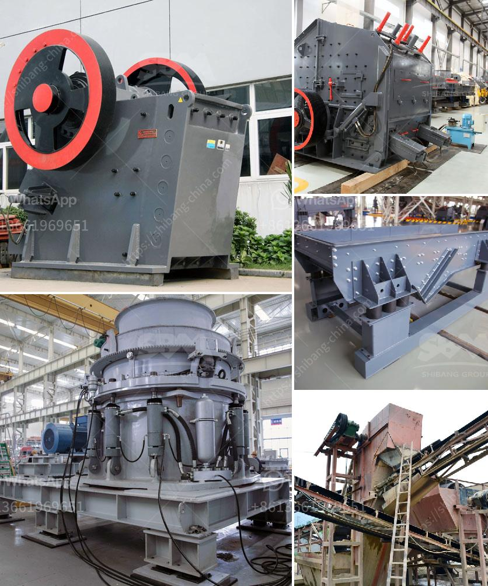

<h3>aggregate stone crusher price south africa</h3>
Aggregate stone crusher price south africa is mainly used in the ore processing industry, building materials and civil engineering. It is used to process aggregate for construction projects such as road construction, railway construction and bridge construction. With the rapid development of urbanization, the demand for aggregate is increasing, which makes aggregate stone crusher prices also rise.

In recent years, due to the continuous increase in the price of raw materials such as steel, cement and sand, the price of aggregate stone crushers in South Africa has also risen accordingly. Some factors that may affect the price include the manufacturer, region, model, technology and so on. In order to get a right price, it is necessary to compare multiple suppliers and choose a reliable one.

First of all, let's analyze the factors that affect the price of aggregate stone crushers in South Africa.

1. Manufacturer. The direct selling manufacturers are cheaper than the agents, so the price of aggregate stone crusher is lower.

2. Region. The price of aggregate stone crushers in different regions may be different. For example, the price of aggregate stone crushers in Cape Town and Durban is relatively low.

3. Model. Jaw crushers are generally divided into PE series, PEW series and mobile jaw crushing plant. The specific model selection should be based on the user's per hour output and material requirements.

4. Technology. The technology level of aggregate stone crushing plant is high, the key technology lies in the operation of the equipment and maintenance.

5. after-sales service. For after-sales service, we must not only consider the quality of service, but also consider whether the manufacturer's service can be guaranteed in the future.

Pe series jaw crushers are generally used as primary crushers in aggregates production line. Their feed opening is 150*250mm and the maximum feed size is 125mm, which is suitable for coarse crushing. PEW series jaw crushers have larger feed opening and higher production capacity than PE series jaw crushers. The feed opening of PEW series jaw crusher is 150*250mm and the maximum feed size is 125mm. The mobile jaw crushing plant is equipped with jaw crusher and vibrating screen, both equipped with diesel engines, convenient for transportation and installation.

In conclusion, the price of aggregate stone crusher in South Africa is influenced by many factors, including the manufacturer, region, model, technology and so on. Its price is reasonable and worthy of reference. Welcome to consult and purchase.
<h3>Contact us</h3><ul><li><strong>Whatsapp:&nbsp;<a href="https://wa.me/8613661969651">+8613661969651</a></strong></li><li><a href="https://swt.shibang-china.com/?git&amp;zhl&amp;aggregate stone crusher price south africa"><strong>Online Service(chat now)</strong></a></li></ul><h3>Related</h3><ul><li><a href='jaw crusher plant price.md'>jaw crusher plant price</a></li><li><a href='gypsum board plant initial investment.md'>gypsum board plant initial investment</a></li><li><a href='used granite crusher machinery.md'>used granite crusher machinery</a></li><li><a href='gypsum powder price in south africa.md'>gypsum powder price in south africa</a></li><li><a href='ball mill machine price.md'>ball mill machine price</a></li></ul>