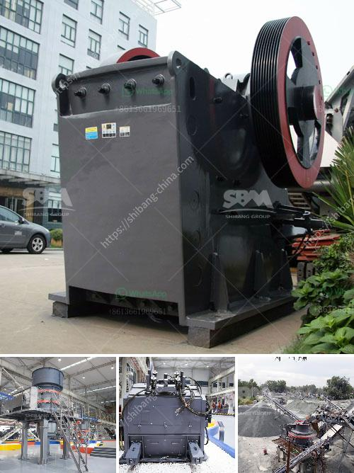

<h3>aggregate washing plant</h3>
An aggregate washing plant is a machine designed to clean and separate coarse and fine aggregates from impurities. With the increasing demand for quality aggregates across the construction industry, it has become essential to wash and clean aggregates to meet the required specifications.

The aggregate washing plant typically consists of several different systems such as the feeding system, screening system, sand washing system, and wastewater recovery system. These systems work together to remove impurities, such as clay, silt, and vegetation, from the raw aggregate materials.

The feeding system is responsible for delivering the raw materials into the plant, where they are sorted and classified according to size. The screening system uses screens of various sizes to separate the aggregates into different grades. The sand washing system washes the fine aggregates to remove any remaining impurities, ensuring the final product meets the desired specifications.

One of the essential components of an aggregate washing plant is the wastewater recovery system. This system collects and processes the water used in the washing process, ensuring a sustainable and environmentally friendly operation. The recovered water is treated and recycled back into the system, reducing water consumption and minimizing the plant's impact on the environment.

There are several benefits of using an aggregate washing plant. Firstly, it improves the quality of the final product by removing impurities and ensuring that each aggregate meets the required specifications. This results in stronger and more durable construction materials.

Secondly, it reduces the need for manual labor, as the plant automates the process of washing and separating aggregates. This not only saves time but also improves worker safety by minimizing exposure to potentially harmful materials.

Lastly, an aggregate washing plant reduces the environmental impact of aggregate production. By recycling and reusing water, it minimizes water consumption and reduces the amount of wastewater generated. Additionally, the plant's efficient operation contributes to the overall sustainability of the construction industry.

In conclusion, an aggregate washing plant is an essential machine for the production of high-quality aggregates. Its various systems, such as feeding, screening, sand washing, and wastewater recovery, work together to clean and separate aggregates, resulting in a superior final product. Furthermore, it reduces manual labor, improves worker safety, and contributes to the industry's sustainability efforts.
<h3>Contact us</h3><ul><li><strong>Whatsapp:&nbsp;<a href="https://wa.me/8613661969651">+8613661969651</a></strong></li><li><a href="https://swt.shibang-china.com/?git&amp;zhl&amp;aggregate washing plant"><strong>Online Service(chat now)</strong></a></li></ul><h3>Related</h3><ul><li><a href='iron ore crushing equipment cost.md'>iron ore crushing equipment cost</a></li><li><a href='crushed stone suppliers manufacture india.md'>crushed stone suppliers manufacture india</a></li><li><a href='crusher machine company in spain.md'>crusher machine company in spain</a></li><li><a href='small scale quarry mining equipment.md'>small scale quarry mining equipment</a></li><li><a href='fuller traylor nt gyratory crusher manual.md'>fuller traylor nt gyratory crusher manual</a></li></ul>