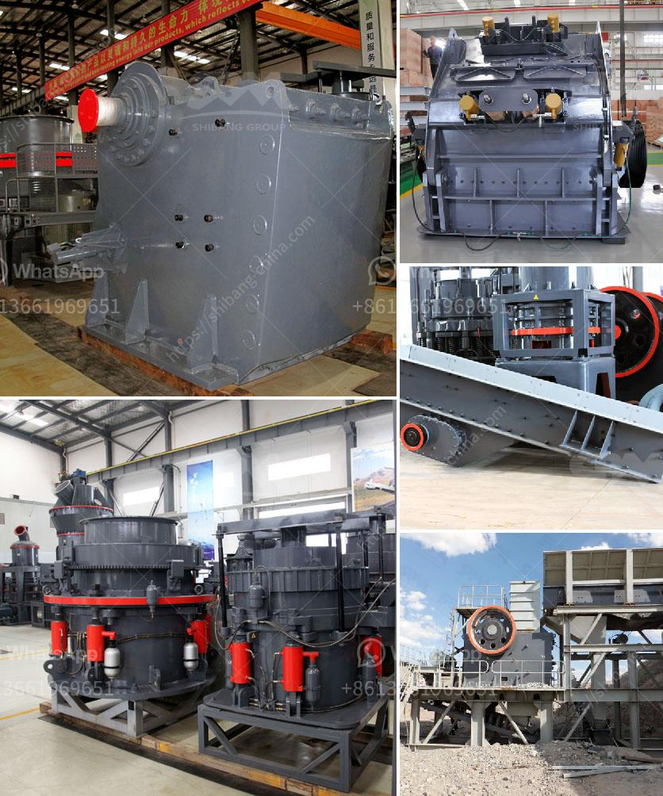

<h3>all about ball mills</h3>
Ball mills are a type of grinder used for grinding and blending materials for use in various industries. A ball mill works on the principle of impact and attrition: size reduction is done by impact as the balls drop from near the top of the shell. A ball mill consists of a hollow cylindrical shell rotating about its axis. The axis of the shell may be either horizontal or at a small angle to the horizontal. It is partially filled with balls. The grinding media is the balls, which may be made of steel, stainless steel, ceramic, or rubber.

Ball mills are used extensively in the mechanical alloying process in which they are not only used for grinding but for cold welding as well, with the purpose of producing alloys from powders. The ball mill is a key piece of equipment for grinding crushed materials, and it is widely used in production lines for powders such as cement, silicates, refractory material, fertilizer, glass ceramics, etc., as well as for ore dressing of ferrous and non-ferrous metals. The ball mill can grind ores and other materials wet or dry.

The basic construction of a ball mill involves a rotating cylinder containing balls mounted on a metallic frame. The shell is rotated at a predetermined speed, causing the balls to cascade and grind the material. When the shell rotates, the balls are lifted up on the rising side of the shell and then they cascade down from near the top of the shell, creating shattering and grinding impacts. The particle size of the material that is being reduced determines the number of impacts the ball mill has to create, thus optimizing the grinding efficiency.

A ball mill is commonly used in the manufacturing of cement and finer grinding stages of mineral processing. Typical ball mills operate with a maximum ball size of 40 mm, and can be as large as 8.5 m in diameter. The length of the ball mill is typically 1.5 to 2 times longer than the diameter, which is in the range of 3 to 5 meters. Depending on the size of the mill and the desired size reduction, different types of media are used. The grinding media can be made of hardened steel, stainless steel, ceramic, or rubber, with sizes ranging from 6 to 100 mm in diameter.

Ball mills are widely used in the mining industry, construction industry, and chemical industry for many different applications. They are an essential tool for grinding, blending, and mixing materials for use in various processes. Besides the traditional grinding, ball mills can also perform other functions such as reducing particle size, blending materials, or homogenizing viscous materials. The versatility and efficiency of ball mills make them a critical piece of equipment in many industries.

In conclusion, ball mills are essential equipment in various industries for grinding, blending, and homogenizing materials. They work on the principle of impact and attrition, and can be used wet or dry. The size, material, and design of the ball mill determine its grinding efficiency and suitability for the specific application. From the manufacturing of cement to mineral processing, ball mills play a crucial role in achieving desired outputs.
<h3>Contact us</h3><ul><li><strong>Whatsapp:&nbsp;<a href="https://wa.me/8613661969651">+8613661969651</a></strong></li><li><a href="https://swt.shibang-china.com/?git&amp;zhl&amp;all about ball mills"><strong>Online Service(chat now)</strong></a></li></ul><h3>Related</h3><ul><li><a href='small scale quarry mining equipment.md'>small scale quarry mining equipment</a></li><li><a href='gold plant for sale in africa.md'>gold plant for sale in africa</a></li><li><a href='cost of starting a small gold mine zimbabwe.md'>cost of starting a small gold mine zimbabwe</a></li><li><a href='china silica sand vibrating separator screen.md'>china silica sand vibrating separator screen</a></li><li><a href='two roller mill.md'>two roller mill</a></li></ul>