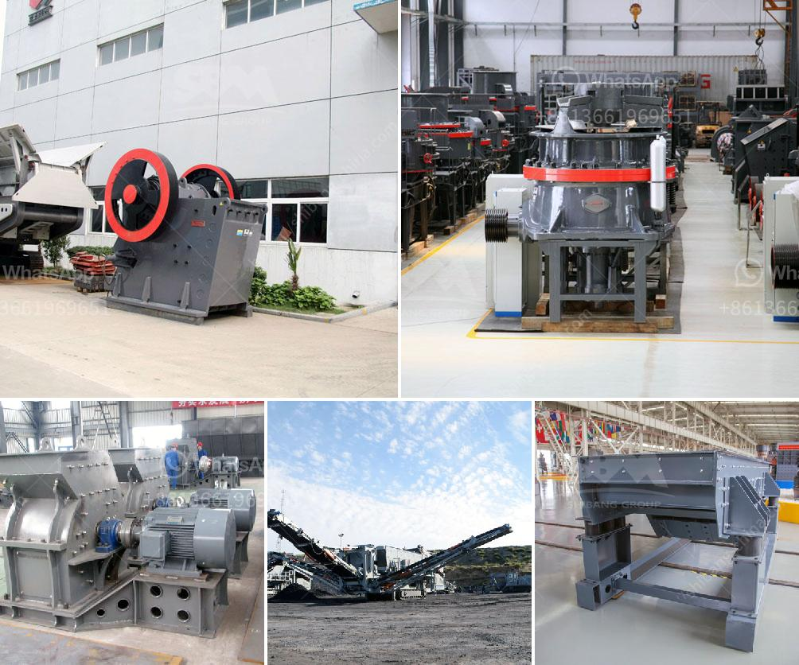

<h3>alluvial gold washing plants</h3>
Alluvial gold washing plants are specialized equipment designed to wash alluvial gold deposits. These types of deposits are found mainly in riverbeds, riverbanks, or shallow coastal areas. Gold particles are trapped in the sedimentary rocks and gravel deposited by water movement due to their high density.

In order to extract gold from these deposits, miners employ various techniques, and one of the most common is using alluvial gold washing plants. These plants utilize different methods to wash the gold-bearing gravel, separating the particles from the lighter sediment and impurities.

One of the main components of an alluvial gold washing plant is the sluice box. This box is essentially a long trough with riffles or obstructions along its bottom surface. The gravel and sediment are fed into the sluice box and water is pumped in, allowing the gold particles to settle between the riffles. The water washes away the lighter sediment and leaves behind the gold concentrates.

Another important element of the alluvial gold washing plant is the trommel screen. This cylindrical drum rotates and separates the oversized gravel from the smaller particles, ensuring that only the appropriate size material enters the sluice box. The trommel screen is essential to ensure the efficient operation of the plant and maximize gold recovery.

To further enhance the efficiency of alluvial gold washing plants, miners may utilize various additional equipment. For instance, jigs can be used to separate gold particles based on their specific gravity. Vibration tables or shaking tables can also be employed to further concentrate the gold concentrates. These additional steps help to increase gold recovery and minimize losses.

Alluvial gold washing plants are highly adaptable, allowing miners to tailor their setups based on the specific characteristics of the deposit. Factors such as the particle size distribution, gold particle liberation, and water availability can all influence plant design. Therefore, plant configurations can vary significantly, ranging from small-scale operations to large-scale industrial setups, depending on the size of the deposit and the available resources.

Efficient alluvial gold washing plants play a crucial role in enabling sustainable and responsible mining practices. By effectively separating gold from the sediment and impurities, these plants help to minimize the environmental impact of mining operations. Additionally, they contribute to improving the livelihoods of small-scale miners who rely on alluvial gold deposits for their income.

In conclusion, alluvial gold washing plants are vital equipment for extracting gold from sedimentary deposits. They employ various methods, including sluice boxes, trommel screens, jigs, and shaking tables, to separate gold particles from sediment and impurities. The design of these plants can vary based on the deposit characteristics, and they play a significant role in promoting sustainable and responsible mining practices.
<h3>Contact us</h3><ul><li><strong>Whatsapp:&nbsp;<a href="https://wa.me/8613661969651">+8613661969651</a></strong></li><li><a href="https://swt.shibang-china.com/?git&amp;zhl&amp;alluvial gold washing plants"><strong>Online Service(chat now)</strong></a></li></ul><h3>Related</h3><ul><li><a href='slag crushing plant.md'>slag crushing plant</a></li><li><a href='small mobile crushers.md'>small mobile crushers</a></li><li><a href='how to make a ball crusher.md'>how to make a ball crusher</a></li><li><a href='gravel vibrating screen.md'>gravel vibrating screen</a></li><li><a href='mica pearl process flowchart.md'>mica pearl process flowchart</a></li></ul>