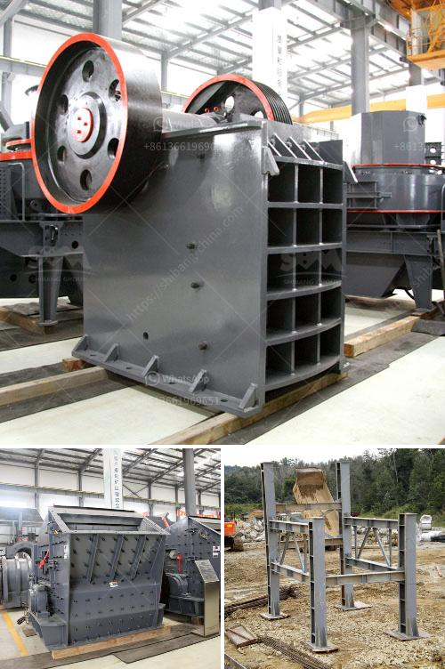

<h3>antimony ore processing plant design</h3>
Antimony is a strategic metal with various applications in various industries. It is a low-conductive metal with high resistance to corrosion, making it an essential material in the production of batteries, flame retardants, and makeup products. However, before these antimony-based products reach the market, they undergo a complex extraction process in antimony ore processing plants.

The design of an antimony ore processing plant is driven by the commercial and industrial applications of the metal, as well as the various properties of antimony. This metal has diverse industrial applications – from flame retardants and batteries to semiconductors and ceramics. Therefore, the processing plant must be designed to efficiently extract antimony from its ore while meeting the demand and quality standards of the industry.

The first step in designing an antimony ore processing plant is to understand the properties of the ore. Antimony ores are generally found in the form of sulfide ores, such as stibnite. The chemical composition of antimony ore is complex and includes elements like sulfur, iron, and lead. Therefore, the ore is not suitable for direct use in commercial applications and needs to undergo a beneficiation process.

The beneficiation process involves crushing and grinding the ore to a suitable size and then separating the valuable minerals from the waste rock. In the case of antimony ore, flotation is often used as the primary beneficiation method. This involves mixing the finely crushed ore with water and chemicals, known as collectors and frothers, which help to separate the valuable minerals from the waste material.

After the flotation process, the concentrate containing antimony is dewatered and further processed. This involves smelting the concentrate to produce antimony metal or compounds. The choice of the smelting process depends on the final product required and the impurities present in the concentrate. The most common smelting process for antimony is known as the blast furnace process, which involves heating the concentrate with carbon to produce antimony metal.

The design of an antimony ore processing plant must take into account several factors to ensure that the process is efficient and economical. The selection of the beneficiation method and equipment should be based on the specific properties of the ore and the desired final product. Additionally, the plant design should consider the environmental impact of the process and incorporate measures to mitigate any potential harm.

In conclusion, the design of an antimony ore processing plant is crucial in ensuring the efficient extraction of antimony from its ore. The plant must consider the properties of the ore, the desired final product, and the environmental impact of the process. Through careful planning and engineering, antimony ore processing plants can meet the demand for this strategic metal and contribute to various industries worldwide.
<h3>Contact us</h3><ul><li><strong>Whatsapp:&nbsp;<a href="https://wa.me/8613661969651">+8613661969651</a></strong></li><li><a href="https://swt.shibang-china.com/?git&amp;zhl&amp;antimony ore processing plant design"><strong>Online Service(chat now)</strong></a></li></ul><h3>Related</h3><ul><li><a href='gold mining business plan ghana.md'>gold mining business plan ghana</a></li><li><a href='charcoal pulverizer machine philippines.md'>charcoal pulverizer machine philippines</a></li><li><a href='double roller crusher advantages.md'>double roller crusher advantages</a></li><li><a href='100tph stationery stone crushing plant.md'>100tph stationery stone crushing plant</a></li><li><a href='dolomite grinding machines suppliers in india.md'>dolomite grinding machines suppliers in india</a></li></ul>