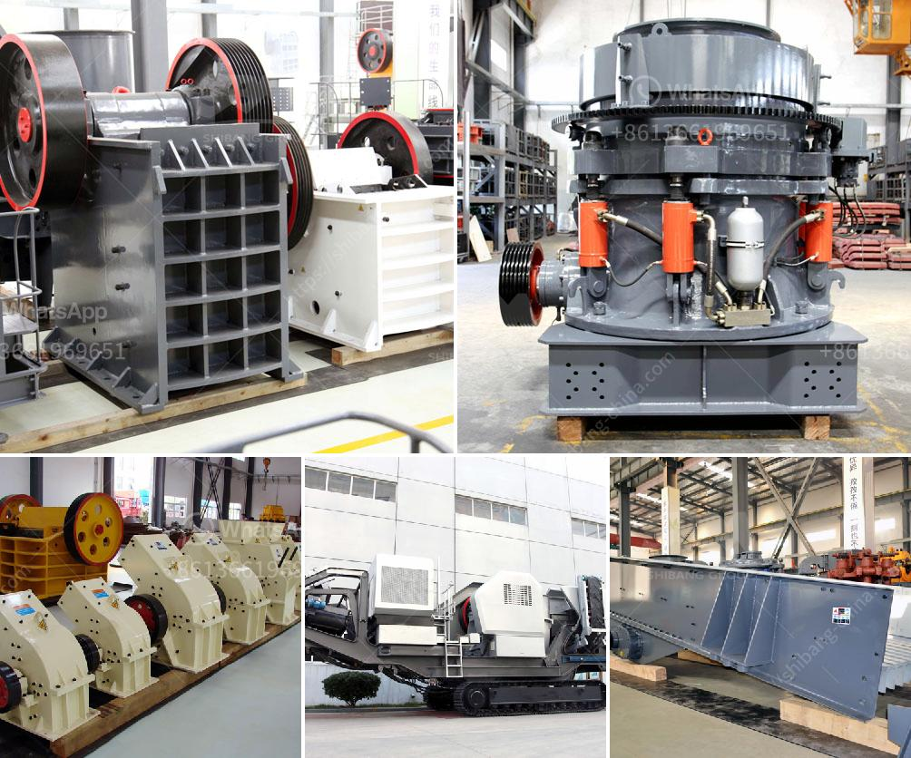

<h3>apolo grinding mill price in india</h3>
The Apolo grinding mill is a popular and reliable grinding machine that is well-suited for domestic use. It comes with a sleek design, sturdy construction, and a powerful motor, making it an ideal choice for grinding various types of grains and spices. In this article, we will discuss the Apolo grinding mill's price in India and the features that make it a worthy investment.

When it comes to purchasing a grinding mill, price is an important factor to consider. In India, the Apolo grinding mill is reasonably priced, making it an affordable option for those looking to purchase a high-quality grinding machine without breaking the bank. The price of the Apolo grinding mill in India ranges from around INR 3,500 to 4,500, depending on the capacity and features.

One of the key features of the Apolo grinding mill is its efficient motor. With a power of 750 watts, it can easily grind various ingredients, including grains, lentils, and spices, within minutes. The powerful motor ensures fast and efficient grinding, saving you valuable time in the kitchen. Whether you want to make fresh flour for chapatis or grind spices for your favorite curry, the Apolo grinding mill can handle it all effortlessly.

Furthermore, the Apolo grinding mill is made from high-quality materials, ensuring its durability and longevity. The sturdy construction not only enhances its performance but also adds to its aesthetic appeal. With a sleek and modern design, this grinding mill will seamlessly blend into any kitchen decor, making it a stylish addition to your countertop.

In terms of convenience, the Apolo grinding mill ticks all the boxes. It is easy to use, thanks to its simple controls and intuitive interface. The transparent lid allows you to monitor the grinding process, ensuring that the ingredients are ground to your desired consistency. Cleaning the grinding mill is also hassle-free, as most parts are detachable and dishwasher safe.

Another noteworthy feature of the Apolo grinding mill is its versatility. It comes with multiple jars and blades, allowing you to grind different ingredients with ease. Whether you need to make fine flour for baking or coarse powder for masalas, this grinding mill has you covered. The different jars also make it convenient to store and use multiple ingredients without cross-contamination.

In conclusion, the Apolo grinding mill is an excellent investment for those seeking a reliable and efficient grinding machine for their kitchen. With its reasonable price, powerful motor, and durable construction, it offers great value for money. Whether you want to grind grains, lentils, or spices, this grinding mill can handle it all effortlessly. So, why wait? Bring home the Apolo grinding mill and elevate your cooking experience to the next level.
<h3>Contact us</h3><ul><li><strong>Whatsapp:&nbsp;<a href="https://wa.me/8613661969651">+8613661969651</a></strong></li><li><a href="https://swt.shibang-china.com/?git&amp;zhl&amp;apolo grinding mill price in india"><strong>Online Service(chat now)</strong></a></li></ul><h3>Related</h3><ul><li><a href='mini crusher for gravel.md'>mini crusher for gravel</a></li><li><a href='hammer mills for granite.md'>hammer mills for granite</a></li><li><a href='jaw crusher for 220x160.md'>jaw crusher for 220x160</a></li><li><a href='white stone crusher plant in rajasthan.md'>white stone crusher plant in rajasthan</a></li><li><a href='coal mining equipment coal mining equipment for sale.md'>coal mining equipment coal mining equipment for sale</a></li></ul>