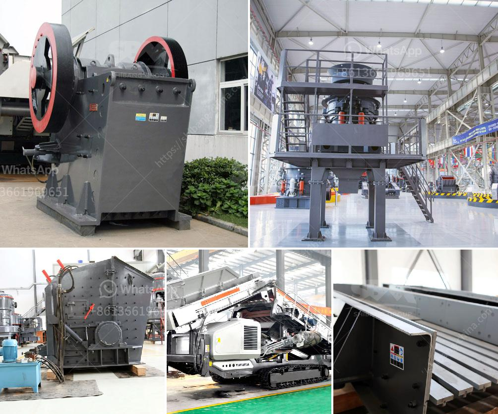

<h3>application of hammer mill</h3>
The hammer mill is a machine that is driven by an electric motor or diesel engine, and it comprises a rotating shaft with hammers or blades that repeatedly beat the material to be processed (usually grains or seeds) into smaller particles. In this article, we will discuss the application of the hammer mill.

One of the primary applications of the hammer mill is in the agricultural industry. Many farmers use the hammer mill to grind materials such as corn, soybean, and wheat into a fine consistency that is suitable for feeding livestock. The hammer mill is also a useful machine for the brewing industry, thanks to its ability to efficiently grind malted barley into crushed grains that are specifically sized for brewing.

Another important application for the hammer mill is the processing of materials for the pharmaceutical and medical industries. The hammer mill can effectively reduce the particle size of pharmaceutical ingredients and drugs, ensuring optimal absorption or dissolution upon consumption. It is commonly used in the production of medicines, dietary supplements, and health products.

Furthermore, the hammer mill is widely utilized in recycling facilities. Many recycling plants process scrap materials such as wood, plastic, and metals. By using a hammer mill, these materials can be shredded into smaller pieces, making it easier to separate and process later on. The resulting shredded materials can be used as fuel, recycled into new products, or disposed of more efficiently.

In addition to these applications, the hammer mill is also used in various industries for different purposes. For instance, in the mining industry, the hammer mill is used to crush and pulverize oversized rock remnants before sending them through screening or crushing processes. It is also employed in the construction industry to break down old concrete or other rubble into smaller pieces that can be reused as aggregate in new projects.

To conclude, the hammer mill is a versatile and essential machine in many industries. Its ability to effectively grind, crush, and pulverize various materials makes it incredibly useful in agriculture, brewing, pharmaceuticals, recycling, and other sectors. The hammer mill not only enhances efficiency and productivity but also promotes sustainability in terms of waste reduction and material reuse. As technology continues to advance, we can expect further improvements and innovations in the application of the hammer mill, further enhancing its utility and benefits in various industries.
<h3>Contact us</h3><ul><li><strong>Whatsapp:&nbsp;<a href="https://wa.me/8613661969651">+8613661969651</a></strong></li><li><a href="https://swt.shibang-china.com/?git&amp;zhl&amp;application of hammer mill"><strong>Online Service(chat now)</strong></a></li></ul><h3>Related</h3><ul><li><a href='price of roller crusher.md'>price of roller crusher</a></li><li><a href='conveyor belt structure design.md'>conveyor belt structure design</a></li><li><a href='widely used small stone jaw crusher crusher.md'>widely used small stone jaw crusher crusher</a></li><li><a href='granite machine manufacturer india.md'>granite machine manufacturer india</a></li><li><a href='recycling machines stone production.md'>recycling machines stone production</a></li></ul>