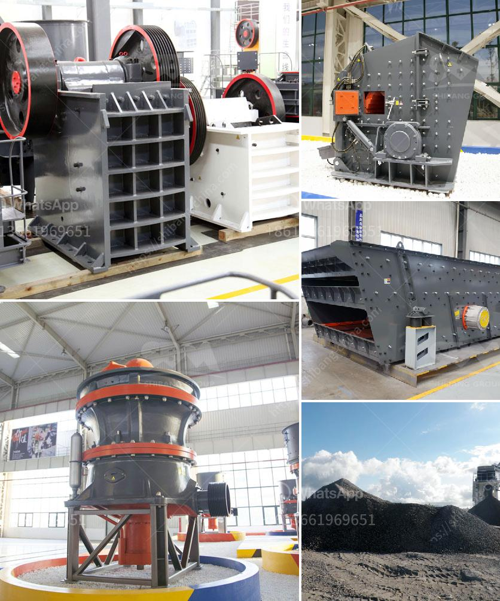

<h3>application of vertical grinding machine</h3>
The application of vertical grinding machines in the industrial sector has been steadily growing over the years. These machines offer numerous benefits and advantages for various industries, making them a sought-after choice for many businesses.

Vertical grinding machines are designed to provide precise and efficient grinding of various materials. They are commonly used in applications such as aerospace, automotive, electronic, and medical industries. These machines can effectively grind large and heavy workpieces with high precision and accuracy.

One of the main advantages of vertical grinding machines is their versatility. They can be used for grinding various materials, including metals, ceramics, and composites. This makes them suitable for a wide range of applications, from shaping and finishing workpieces to removing excess material and achieving high surface quality.

Another significant benefit of vertical grinding machines is their ability to handle complex geometries with ease. These machines are equipped with multiple axes, allowing for complete control and precise grinding of intricate shapes and contours. This is particularly useful in industries that require intricate and precise parts, such as the aerospace and medical sectors.

Vertical grinding machines are also known for their high productivity and efficiency. With their advanced automation features, these machines can perform multiple grinding operations simultaneously, reducing downtime and maximizing productivity. Additionally, their high-speed grinding capabilities enable faster processing times, resulting in increased efficiency and reduced production costs.

Safety is another crucial aspect of vertical grinding machines. These machines are designed with robust safety mechanisms to ensure the protection of operators and prevent accidents. They are equipped with safety features such as guards, emergency stop buttons, and interlock systems that ensure safe operation and minimize the risk of injuries.

Maintenance and servicing of vertical grinding machines are relatively straightforward. These machines are built to withstand heavy-duty use and require minimal maintenance. Regular cleaning and lubrication are typically sufficient to keep them in good working condition, reducing downtime and maintenance costs.

In conclusion, the application of vertical grinding machines has become increasingly popular in various industries due to their versatility, precision, productivity, and safety features. These machines offer a range of benefits, including the ability to grind various materials, handle complex geometries, and achieve high productivity. Their advanced automation features and ease of maintenance make them a cost-effective solution for many businesses. With the continuous advancements and innovations in grinding technology, vertical grinding machines are expected to further enhance their capabilities and become even more indispensable in the industrial sector.
<h3>Contact us</h3><ul><li><strong>Whatsapp:&nbsp;<a href="https://wa.me/8613661969651">+8613661969651</a></strong></li><li><a href="https://swt.shibang-china.com/?git&amp;zhl&amp;application of vertical grinding machine"><strong>Online Service(chat now)</strong></a></li></ul><h3>Related</h3><ul><li><a href='tons per hour mobile crushers.md'>tons per hour mobile crushers</a></li><li><a href='coal crusher and screening plants for sale.md'>coal crusher and screening plants for sale</a></li><li><a href='crushing and serreing machinery.md'>crushing and serreing machinery</a></li><li><a href='horizontally ball mill.md'>horizontally ball mill</a></li><li><a href='chinese stone crusher machine.md'>chinese stone crusher machine</a></li></ul>