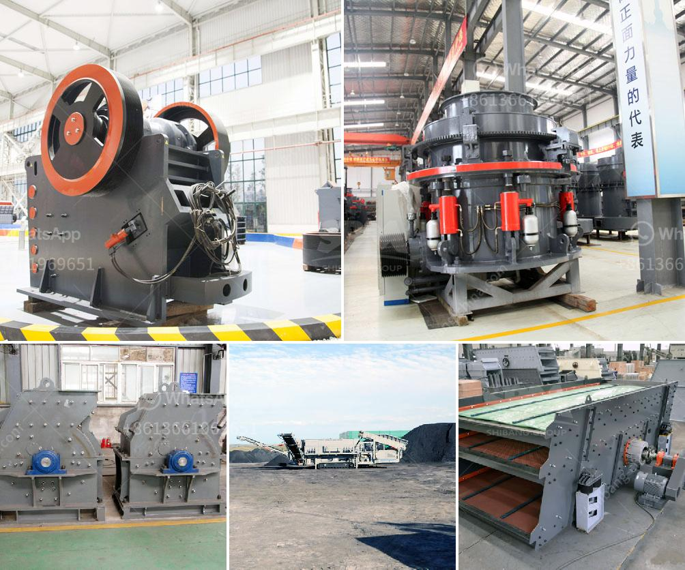

<h3>automated roller conveyors</h3>
In the ever-evolving world of manufacturing and logistics, efficiency is key. As businesses strive to optimize their operations, automated roller conveyors have emerged as a game-changing solution for material handling. These conveyor systems, driven by advanced technology, are revolutionizing the way goods are transported within warehouses, factories, and distribution centers.

Automated roller conveyors are essentially a series of motorized rollers that move payloads from one point to another, eliminating the need for manual handling. These roller systems are designed to transport a wide range of materials, including boxes, pallets, and even heavier loads. By automating the process, businesses can significantly reduce the risk of injury, enhance productivity, and improve overall workflow.

One of the significant advantages of automated roller conveyors is their flexibility. These systems can be easily integrated into existing infrastructure, making them a versatile solution for different setups. With adjustable heights, widths, and lengths, roller conveyors can be customized to meet specific requirements, catering to various payload sizes and shapes. This adaptability ensures seamless integration into any manufacturing or warehousing environment.

Beyond the flexibility in customization, automated roller conveyors also offer versatility in their functionality. Advanced conveyor control systems enable precise control and coordination of material movement. By employing sensors, scanners, and automated sorting mechanisms, these conveyors can efficiently route payloads to their designated destinations. Automated diverter gates and stops further enhance the flexibility by allowing operators to divert or halt the movement of materials as needed.

Efficiency and speed play a crucial role in any material handling operation, and automated roller conveyors excel in both areas. By eliminating manual handling, these systems drastically reduce the time required to transport goods, leading to increased throughput. The motorized rollers enable smooth and consistent movement, minimizing the risk of jams or bottlenecks in the workflow. This optimized workflow translates into faster processing times, shorter lead times, and improved customer satisfaction.

Moreover, automated roller conveyors are designed with durability and reliability in mind. The components used in their construction are built to withstand heavy loads and constant use, ensuring longevity and minimal downtime. Integrated safety features, such as emergency stop buttons and protective guarding, guarantee the well-being of both operators and payloads.

Investing in automated roller conveyors is an investment in the future. With the continuous advancements in technology, these systems are becoming smarter and more sophisticated. The integration of artificial intelligence and machine learning allows automated conveyors to adapt and optimize their performance based on real-time data. Predictive maintenance capabilities help prevent unexpected breakdowns, reducing downtime and maintenance costs.

In conclusion, automated roller conveyors have emerged as an ideal solution for businesses looking to streamline their material handling processes. They offer flexibility, efficiency, and reliability, transforming the way goods are transported within manufacturing facilities and warehouses. With their ability to integrate seamlessly into existing setups and their adaptability to different payload types, automated roller conveyors are undoubtedly shaping the future of material handling. As businesses strive to gain a competitive edge, embracing this technology is a step towards achieving operational excellence in the modern world.
<h3>Contact us</h3><ul><li><strong>Whatsapp:&nbsp;<a href="https://wa.me/8613661969651">+8613661969651</a></strong></li><li><a href="https://swt.shibang-china.com/?git&amp;zhl&amp;automated roller conveyors"><strong>Online Service(chat now)</strong></a></li></ul><h3>Related</h3><ul><li><a href='price for vsi crusher.md'>price for vsi crusher</a></li><li><a href='how to charge grinding media in ball mill.md'>how to charge grinding media in ball mill</a></li><li><a href='sand making machine price.md'>sand making machine price</a></li><li><a href='raymond mill price list.md'>raymond mill price list</a></li><li><a href='rock crusher road construction.md'>rock crusher road construction</a></li></ul>