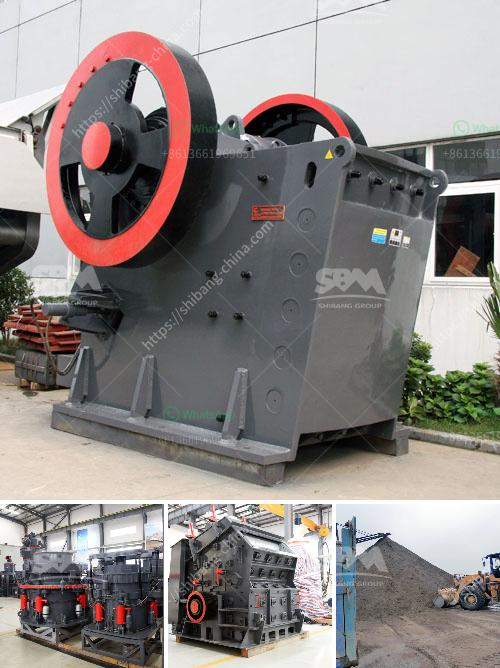

<h3>ball grinding mill</h3>
Ball grinding mill is a key equipment in grinding operations. It is extensively used in industries like cement, silicate products, new building materials, refractory materials, fertilizers, ferrous and non-ferrous metals beneficiation, and glass ceramics. It can perform dry or wet grinding for various ores and other materials. 

The ball grinding mill is composed of a horizontal cylinder, a hollow shaft for feeding and discharging materials, and a grinding head. The cylinder is a long cylinder with grinding media in it. The cylinder is made of steel and fixed by a steel liner, which has grinding media within it. The grinding media are usually steel balls, which are often made of stainless steel, high manganese steel, or alloy steel.

The ball grinding mill works in a closed-circuit system, which is characterized by excellent performance, high efficiency, energy-saving, and environmentally friendly features. It can grind various ores and other materials either wet or dry, depending on requirements. It is suitable for grinding hard and brittle materials, such as limestone, coal, or other materials with medium hardness. 

The ball mill has been widely used in industries like mining, construction materials, metallurgy, ceramics, and chemical engineering. To ensure the long-term operation of the ball mill, regular maintenance and inspection are essential. It is crucial to check the lubrication system, gear and pinion, feed and discharge flanges, bearings, liners, and other components to ensure they are in good condition.

The ball grinding mill has various advantages over other grinding mills. It has a simple structure, less investment, and energy-saving. Compared with similar mills, it has a higher production capacity. It can be operated at a lower cost. Furthermore, it has a wide range of applications, making it a versatile grinding tool. It is suitable for both dry and wet grinding, which increases its flexibility in various industries. 

The ball grinding mill has become the primary choice for grinding processes in many industries due to its high grinding efficiency and low power consumption. It can grind various ores and other materials efficiently, including limestone, calcite, talc, barite, quartz, graphite, phosphate rock, and others. The particle size distribution of the finished product is uniform, and the quality is excellent.

In conclusion, the ball grinding mill is a necessary and indispensable tool for regrinding processes. It is useful in various industries due to its high-performance capabilities, cost-effectiveness, and versatility. Continuous advancements in technology have made it even more efficient and reliable. Whether it is used for dry or wet grinding, it can provide excellent results. Its wide range of applications makes it an essential tool in various fields. Therefore, investing in a high-quality ball grinding mill is a wise choice for businesses looking for efficient grinding solutions.
<h3>Contact us</h3><ul><li><strong>Whatsapp:&nbsp;<a href="https://wa.me/8613661969651">+8613661969651</a></strong></li><li><a href="https://swt.shibang-china.com/?git&amp;zhl&amp;ball grinding mill"><strong>Online Service(chat now)</strong></a></li></ul><h3>Related</h3><ul><li><a href='vertical hammer crusher.md'>vertical hammer crusher</a></li><li><a href='raymond vertical mill product size 3 30 micron.md'>raymond vertical mill product size 3 30 micron</a></li><li><a href='ton per hour coal crushing plant.md'>ton per hour coal crushing plant</a></li><li><a href='coal and iron ore mining business plan pdf.md'>coal and iron ore mining business plan pdf</a></li><li><a href='fullers earth powder grinding machines in india.md'>fullers earth powder grinding machines in india</a></li></ul>