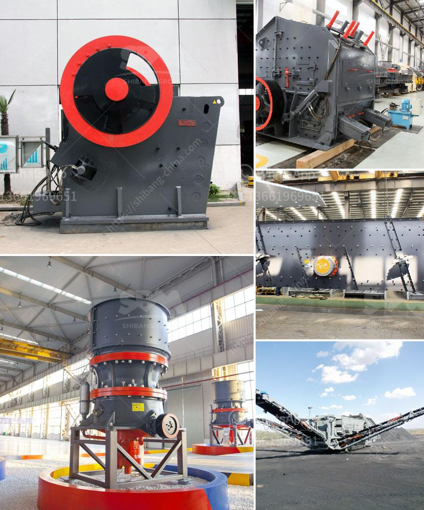

<h3>ball mill ball portable</h3>
Grinding and milling processes are essential in various industries, such as mining, construction, and pharmaceuticals, where particle size reduction is crucial. One versatile tool that is commonly used for this purpose is a ball mill ball portable. Offering convenience and efficiency, this tool has become a staple in many production lines.

The ball mill ball portable is a grinding medium used in ball grinding mills. It is a cylindrical container filled with grinding balls made of steel or other materials. The grinding balls are continuously fed into the mill along with the material to be ground, and they mix and crush the particles with the help of friction and impact. This process results in the desired particle size reduction.

Portability is one of the key advantages of the ball mill ball portable. Unlike traditional stationary ball mills, the portable version can be easily moved from one location to another. This flexibility allows for greater efficiency in various scenarios. For example, in mining operations, where ore needs to be processed on-site, the portable ball mill ball can be transported to the site and set up quickly. This eliminates the need for costly transportation of ore to a stationary mill and, in turn, reduces overall operational costs.

Furthermore, the ball mill ball portable is also ideal for small-scale operations or research laboratories where limited space is available. Its compact size and easy installation make it a convenient solution, even in cramped environments.

In addition to portability, the ball mill ball portable also offers excellent performance. It is designed to withstand heavy-duty applications and deliver consistent grinding results. The high strength and durability of the grinding balls ensure efficient and reliable operation, even with prolonged use.

In conclusion, the ball mill ball portable is a practical and versatile grinding solution that provides convenience, efficiency, and excellent performance. Its portable nature allows for easy transportation and setup, making it an ideal choice for various industries and applications. Whether in mining, construction, or research, this tool offers an efficient and reliable method for particle size reduction.
<h3>Contact us</h3><ul><li><strong>Whatsapp:&nbsp;<a href="https://wa.me/8613661969651">+8613661969651</a></strong></li><li><a href="https://swt.shibang-china.com/?git&amp;zhl&amp;ball mill ball portable"><strong>Online Service(chat now)</strong></a></li></ul><h3>Related</h3><ul><li><a href='jaw crushers in south africa.md'>jaw crushers in south africa</a></li><li><a href='gold plant for sale in africa.md'>gold plant for sale in africa</a></li><li><a href='how to make clay powder.md'>how to make clay powder</a></li><li><a href='cement clinker grinding plant for sale in india.md'>cement clinker grinding plant for sale in india</a></li><li><a href='new rubber belt conveyor for sale.md'>new rubber belt conveyor for sale</a></li></ul>