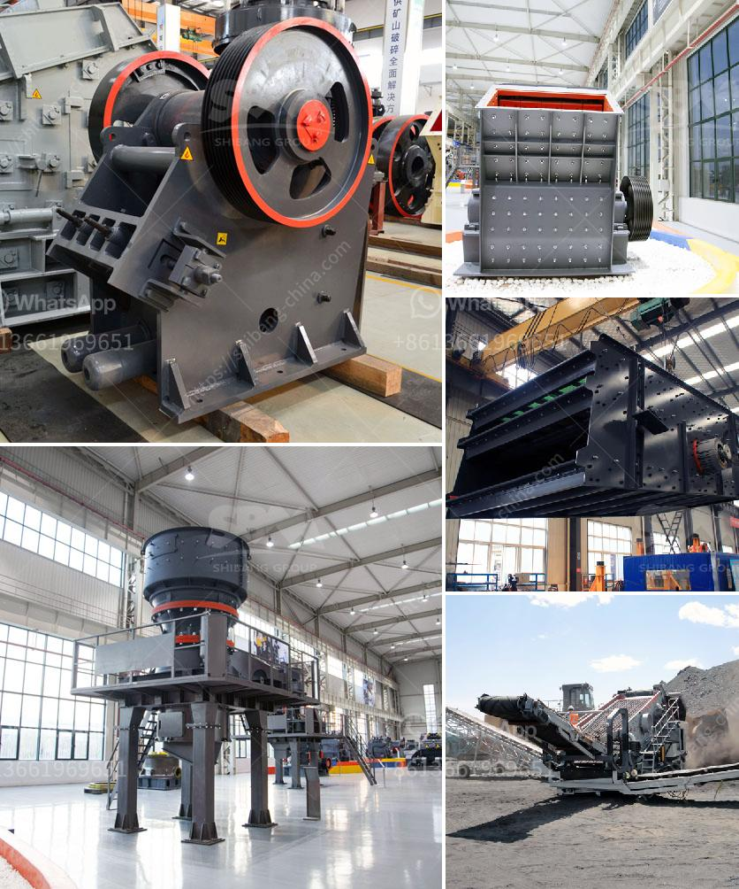

<h3>ball mill calcium carbonat</h3>
Calcium carbonate is a chemical compound with the formula CaCO3. It is a common substance found in rocks as the minerals calcite and aragonite (most notably as limestone, which contains both of those minerals) and is the main component of eggshells, snail shells, seashells, and pearls. Calcium carbonate is the active ingredient in agricultural lime and is created when calcium ions in hard water react with carbonate ions to create limescale. It is also widely used as a filler material in a variety of products, including paper, plastics, paints, and many others. 

To produce calcium carbonate powder, the primary process involved is grinding. Calcium carbonate is typically mined or extracted from limestone or marble. After it is extracted, the material undergoes several stages of crushing and grinding to form the final product. Using a ball mill, the material is grounded into a fine powder by large rotating mills filled with steel balls. The smaller the size of the balls, the finer the powder will be. 

One of the advantages of ball mill calcium carbonate is its ability to produce a high surface area, resulting in a greater surface area for reaction and faster dissolution rate than traditional grinding methods. This increased surface area can facilitate the absorption and utilization of calcium carbonate in various applications. Whether it is used as a dietary supplement or in industrial applications, this increased bioavailability makes ball mill calcium carbonate a highly efficient option. 

In addition to its efficiency, ball milling for calcium carbonate also offers numerous other benefits. Firstly, the process is environmentally friendly, as it does not require additional chemicals or solvents during grinding. This reduces the generation of waste and eliminates the risk of pollution. Secondly, the controlled particle size distribution achieved through ball milling enables manufacturers to optimize the performance and consistency of their end products. This is particularly important in industries such as plastics and rubber, where particle size plays a critical role in the material's properties. 

Furthermore, ball mill calcium carbonate offers versatility in terms of modifying particle size, shape, and surface properties. By adjusting the operating conditions of the ball mill, manufacturers can tailor their calcium carbonate products to suit specific applications. For instance, a coarser particle size may be desired for certain construction materials, while a finer particle size may be preferred for pharmaceutical formulations. 

In conclusion, ball mill calcium carbonate is a highly efficient grinding solution that offers a range of benefits. It provides faster dissolution rate, increased bioavailability, and controlled particle size distribution, making it a versatile and cost-effective option for numerous applications. Whether used in the pharmaceutical, plastics, or construction industry, ball mill calcium carbonate offers manufacturers the ability to optimize their products and improve overall performance. As such, it is a key tool in the production of high-quality calcium carbonate powder.
<h3>Contact us</h3><ul><li><strong>Whatsapp:&nbsp;<a href="https://wa.me/8613661969651">+8613661969651</a></strong></li><li><a href="https://swt.shibang-china.com/?git&amp;zhl&amp;ball mill calcium carbonat"><strong>Online Service(chat now)</strong></a></li></ul><h3>Related</h3><ul><li><a href='crushing plant assembly.md'>crushing plant assembly</a></li><li><a href='portable stone crusher machine in philippines.md'>portable stone crusher machine in philippines</a></li><li><a href='gold ore mining equipment companies in germany.md'>gold ore mining equipment companies in germany</a></li><li><a href='gypsum board making machine price in pakistan.md'>gypsum board making machine price in pakistan</a></li><li><a href='kaolin grinding mill.md'>kaolin grinding mill</a></li></ul>