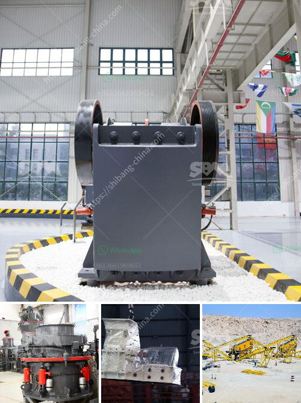

<h3>ball mill capacity for clay</h3>
Ball mills are used for grinding materials such as coal, pigments, and feldspar for pottery. Grinding can be carried out either wet or dry, but the former is performed at low speed. Blending of explosives is an example of an application for low-speed ball mills. The material to be ground is fed from the left through a 60° cone and the product is discharged through a 30° cone to the right. As the shell rotates, the balls are lifted up on the rising side of the shell and they cascade down from near the top of the shell. In doing so, the solid particles in between the balls and ground are reduced in size by impact.

Ball mills have been used for decades to grind and mix materials used in the ceramic industry. Ball milling is a size reduction technique that uses media in a rotating cylindrical chamber to mill materials to a fine powder. As the chamber rotates, the media is lifted up on the rising side and then cascades down from near the top of the chamber. With this motion, the particles in between the media and chamber walls are reduced in size by both impact and abrasion.

The ball mill is a key piece of equipment for grinding crushed materials, and it is widely used in production lines for powders such as cement, silicates, refractory material, fertilizer, glass ceramics, etc., as well as for ore dressing of ferrous and non-ferrous metals. The ball mill can grind ores and other materials either wet or dry.

In terms of application, ball mills are widely used in various grinding and mixing industries such as cement, ceramics, glass, and pharmaceuticals. The grinding and mixing processes can be carried out either wet or dry. The mill reduces the size of the raw materials through impact and attrition. The final product is fine powder, which is ideal for further processing.

The capacity of a ball mill for clay varies depending on the particle size and moisture content of the clay. For example, a ball mill with a larger diameter and shorter length can provide higher capacity for a given volume. It is also important to mention that the balls and the grinding media used inside the ball mill can also affect the grinding efficiency and capacity.

When using a ball mill for clay processing, it is important to choose the right grinding media. The media should be made of a durable material that is able to withstand the abrasive nature of clay. Ceramic grinding media is commonly used for this application due to its high efficiency and low contamination levels.

In conclusion, ball mills are a vital piece of equipment for grinding and mixing materials in various industries. They offer high capacity and efficiency, making them suitable for clay processing. However, it is important to consider factors such as the particle size of the clay and the choice of grinding media to achieve the desired capacity.
<h3>Contact us</h3><ul><li><strong>Whatsapp:&nbsp;<a href="https://wa.me/8613661969651">+8613661969651</a></strong></li><li><a href="https://swt.shibang-china.com/?git&amp;zhl&amp;ball mill capacity for clay"><strong>Online Service(chat now)</strong></a></li></ul><h3>Related</h3><ul><li><a href='vertical horizontal milling machine.md'>vertical horizontal milling machine</a></li><li><a href='sand and gravel plant in nepal.md'>sand and gravel plant in nepal</a></li><li><a href='grinding machine manufacturers from europe.md'>grinding machine manufacturers from europe</a></li><li><a href='limestone crusher india.md'>limestone crusher india</a></li><li><a href='magnesite mining analysis south africa.md'>magnesite mining analysis south africa</a></li></ul>