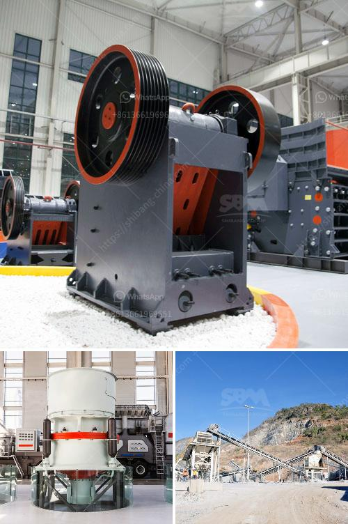

<h3>ball mill cement grinding</h3>
The ball mill is a horizontal rotating device transmitted by the outer gear. The materials are transferred to the grinding chamber through the quill shaft uniformly. There are ladder liner and ripple liner and different specifications of steel balls in the chamber. The centrifugal force caused by rotation of barrel brings the steel balls to a certain height and impact and grind the materials. The ground materials are discharged through the discharging board thus the grinding process is finished.

Ball mill is an efficient tool for grinding many materials into fine powder. The ball mill is used to grind many kinds of mine and other materials, or to select the mine. It is widely used in building material, chemical industry, etc.

There are two ways of grinding: the dry process and the wet process. It can be divided into tabular type and flowing type according to different forms of discharging material.

In recent years, with the continuous improvement of ball mill technology, more and more cement plant owners choose it as their grinding system. It is mainly used for grinding cement clinker in the cement production process. It is also suitable for grinding various ores and other materials in chemical, metallurgy, and power industry, etc.

Compared with traditional ball mills, the ball mill cement grinding system is more energy efficient and environmentally friendly. It can reduce power consumption by 20-30% compared with the ordinary ball mill. Moreover, you can also choose our cement mill according to the specific needs.

We also provide a wide range of sizes to ensure optimum grinding efficiency and easy maintenance. Our ball mill grinding technology is superior and energy-saving, and it can meet various requirements of grinding and drying.

With the increasing demand for cement, ball mill grinding is becoming more and more popular in cement plants. The ball mill grinds cement clinker, gypsum and similar materials of moderate moisture content in a one-compartment or two-compartment system. As the crushing compartments rotate, the balls inside grind the clinker. Ball size determines the degree of product fineness.

In conclusion, the ball mill cement grinding system is an excellent low-power consumption energy-saving and environmental friendly grinding solution. It’s also a great choice for cement producers to expand production output and improve the economic efficiency of their cement grinding plant.
<h3>Contact us</h3><ul><li><strong>Whatsapp:&nbsp;<a href="https://wa.me/8613661969651">+8613661969651</a></strong></li><li><a href="https://swt.shibang-china.com/?git&amp;zhl&amp;ball mill cement grinding"><strong>Online Service(chat now)</strong></a></li></ul><h3>Related</h3><ul><li><a href='mobile iron ore jaw crusher for hire in india.md'>mobile iron ore jaw crusher for hire in india</a></li><li><a href='crushers i want to build a crusher.md'>crushers i want to build a crusher</a></li><li><a href='stones grinding plant thailand.md'>stones grinding plant thailand</a></li><li><a href='project report of a tph stone crusher.md'>project report of a tph stone crusher</a></li><li><a href='italy mobile vibrating screen.md'>italy mobile vibrating screen</a></li></ul>