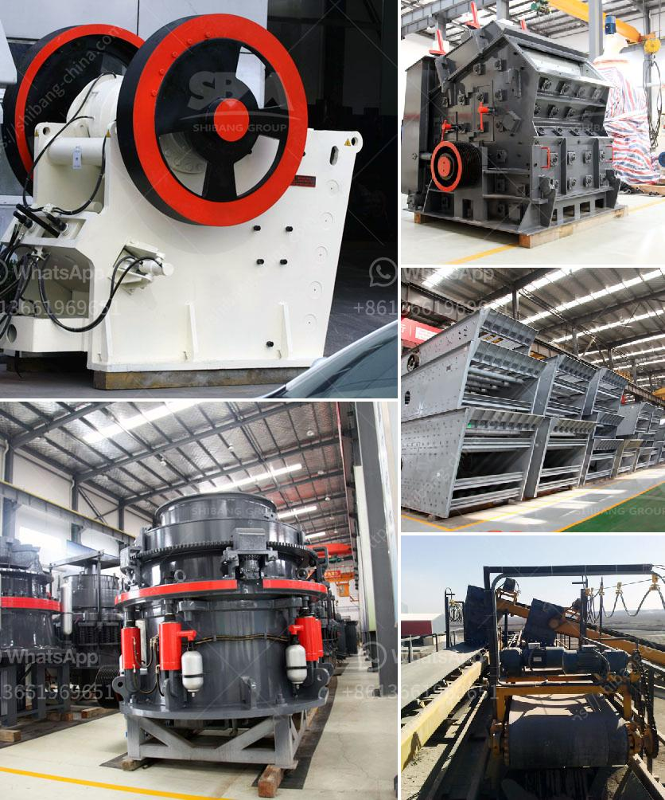

<h3>ball mill company in tamilnadu</h3>
Tamilnadu is one of the major states in India and boasts of a diversified industrial base. It has a significant presence of textile, automotive, engineering, and several other industries. Amidst the plethora of companies operating in Tamilnadu, one industry that stands out is the ball mill industry. With a rich history and a dedicated workforce, the ball mill company in Tamilnadu is known for its quality products and excellent customer service. In this article, we will explore the company's background, its products, and its contribution to the industrial ecosystem in Tamilnadu.

The ball mill company in Tamilnadu was established in the year 1967 with an aim to provide world-class equipment and machinery for various industries. Its product range mainly includes spare parts for cement plants, thermal power plants, crusher spare parts, and material handling equipment. Not only does the company manufacture and supply these products, but it also offers maintenance and consultancy services to ensure the smooth functioning of these crucial machines.

One of the key reasons for the success of the ball mill company in Tamilnadu is its focus on innovation and technology. The company's state-of-the-art manufacturing facilities are equipped with advanced machinery and tools, allowing them to produce high-quality products that meet international standards. The use of cutting-edge technology not only improves the efficiency of their products but also reduces the environmental impact, making it an eco-friendly choice for industries.

Apart from manufacturing and supplying products, the ball mill company in Tamilnadu also excels in providing excellent customer service. Their team of highly skilled engineers and technicians are always ready to assist customers with their queries and concerns. The company believes in establishing long-term relationships with its clients based on trust and mutual understanding.

The ball mill company in Tamilnadu has played a significant role in supporting various industries in the state. For instance, in the cement industry, where grinding of raw materials is a critical process, the company's ball mills are used for grinding and producing high-quality cement. Similarly, in thermal power plants, their equipment is utilized for pulverizing coal, contributing to efficient power generation.

Moreover, the company's commitment to sustainability is evident through its adoption of eco-friendly practices. The ball mill company in Tamilnadu ensures the optimal utilization of resources, minimizing waste generation, and reducing carbon emissions. They also promote the use of renewable energy sources within their facilities, further contributing to a greener future.

In conclusion, the ball mill company in Tamilnadu has proven its worth in the industrial landscape of the state. With its focus on innovation, customer service, and sustainability, it has emerged as a reliable and trusted partner for industries across various sectors. The company's dedication to providing high-quality products and ensuring efficient operations has garnered it a commendable reputation. As Tamilnadu continues to grow industrially, the ball mill company plays a crucial role in supporting the state's development and contributing to its economic prosperity.
<h3>Contact us</h3><ul><li><strong>Whatsapp:&nbsp;<a href="https://wa.me/8613661969651">+8613661969651</a></strong></li><li><a href="https://swt.shibang-china.com/?git&amp;zhl&amp;ball mill company in tamilnadu"><strong>Online Service(chat now)</strong></a></li></ul><h3>Related</h3><ul><li><a href='river sand and stone mining at sabah.md'>river sand and stone mining at sabah</a></li><li><a href='mobile stone crusher control systems.md'>mobile stone crusher control systems</a></li><li><a href='material ball mills.md'>material ball mills</a></li><li><a href='floatation method of analysis for silica sand.md'>floatation method of analysis for silica sand</a></li><li><a href='rock crusher quarry.md'>rock crusher quarry</a></li></ul>