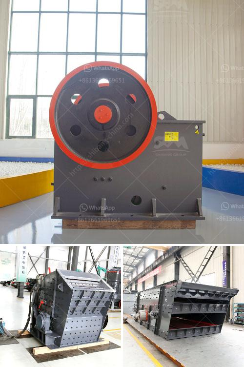

<h3>ball mill equipment 150 ton hr</h3>
Ball mill equipment is the most widely used grinding equipment in the industry, which is the backbone of the development of the industry. Therefore, the development of ball mill equipment is closely related to the progress of the entire industry. The development of the mining industry also promotes the development of mining equipment, such as the ball mill machine.

With the continuous improvement of technology, the ball mill equipment has also undergone a series of innovations. The existing ball mill equipment is mainly composed of cylindrical cylinder, driving gears, linings, partitions and other components. The cylinder is lined with a wear-resistant lining plate, which has good wear resistance. The driving device adopts a gear transmission structure, which is smooth and reliable in operation. The ball mill machine can grind various ores and other materials, such as cement, silicate products, new building materials, refractory materials, fertilizers, ferrous and non-ferrous metal beneficiation, and glass ceramics, etc.

The ball mill equipment with a capacity of 150 tons per hour is the key equipment for grinding after the crushing process. The crushing process refers to the size reduction of large pieces of ore or other materials to a smaller size. This process is mainly achieved by crushers and ball mills. At present, the ore crushing process mainly includes several processes: crushing, grinding, flotation, and filtration.

In the ore crushing process, the ball mill equipment plays a crucial role. The ball mill is mainly used to grind ores and other materials, and then fully expose the mineral particles. The grinding process ensures that the particles are fully ground, which greatly reduces the particle size of the ore. Therefore, the ball mill equipment with a capacity of 150 tons per hour is an essential machine in the beneficiation process.

In the beneficiation process, various materials need to be ground and classified. The ball mill equipment can realize the grinding and classification process at the same time. The particle size of the finished product is relatively uniform, and the qualified materials can be separated in time, avoiding the phenomenon of over-grinding.

In addition to its high processing capacity, the ball mill equipment also has other advantages. The ball mill has low energy consumption and high efficiency. It can save energy consumption by 20%-30% compared with similar products on the market. The ball mill machine also has strong adaptability to materials, which can meet the needs of different grinding operations.

In conclusion, the ball mill equipment with a capacity of 150 tons per hour is an essential machine in the beneficiation process. It plays a vital role in the entire beneficiation process, ensuring the efficient and stable operation of the entire beneficiation plant. With the continuous innovation and improvement of ball mill technology, ball mill equipment will have broader development prospects and provide more significant contributions to the industry.
<h3>Contact us</h3><ul><li><strong>Whatsapp:&nbsp;<a href="https://wa.me/8613661969651">+8613661969651</a></strong></li><li><a href="https://swt.shibang-china.com/?git&amp;zhl&amp;ball mill equipment 150 ton hr"><strong>Online Service(chat now)</strong></a></li></ul><h3>Related</h3><ul><li><a href='manufacture of a conveyor belt.md'>manufacture of a conveyor belt</a></li><li><a href='sand washing machine in saudi arabia.md'>sand washing machine in saudi arabia</a></li><li><a href='small feldspar grinding milling plant in nigeria.md'>small feldspar grinding milling plant in nigeria</a></li><li><a href='bauxite crusher machine.md'>bauxite crusher machine</a></li><li><a href='stone crusher zenith.md'>stone crusher zenith</a></li></ul>