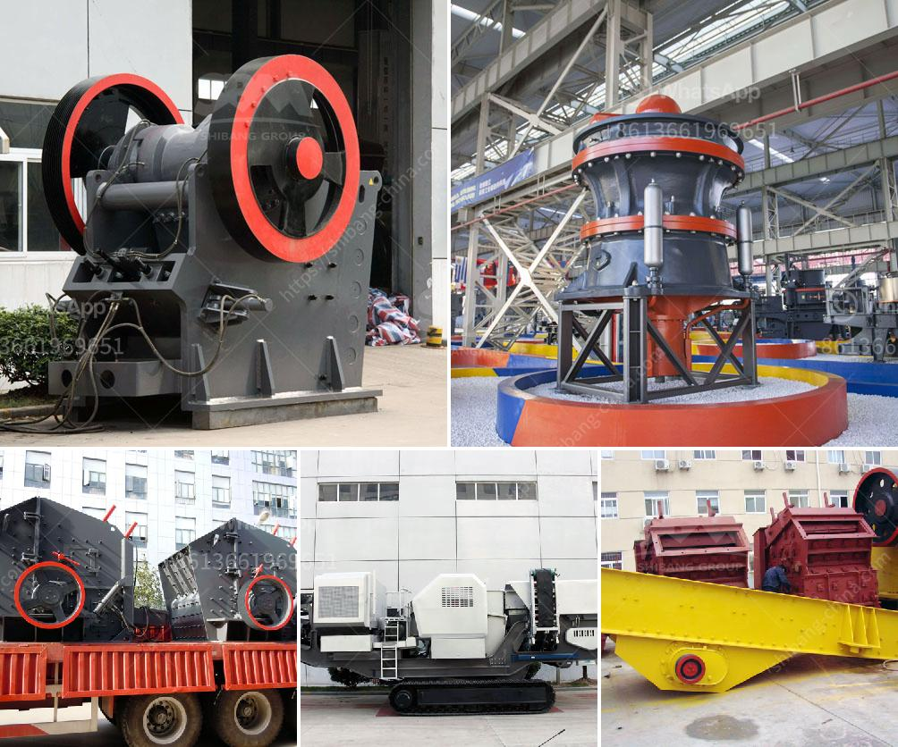

<h3>ball mill equipment 150 tons hr</h3>
Ball mill equipment is the most widely used grinding equipment, where in the grate type ball mill, ball coarse sand through the United feeder returned to the mill equipment to grinding. Feeder for continuous feeding evenly, ore combined feeder continuous evenly into the ball mill equipment, be the ground.

Ball mill equipment is widely used in metallurgy, mining, mineral processing, power, chemical and other industries, the main task is to grind the material into fine powder for the following industrial production processes, such as gold ore grinding plants or cement production lines.

The ball mill equipment is composed of a rotating device, a lattice ball mill, two bins, and an external gear transmission. The material enters the first bin of the mill uniformly through the feeding device through the hollow shaft of the feeding material. There are stepped lining plates or corrugated lining plates in the mill, which contain different specifications of steel balls. The rotating cylinder generates centrifugal force to bring the steel ball to a certain height so that it can fall freely or roll down under the action of gravity to impact and grind the material, thereby achieving the purpose of grinding.

A 150 tons per hour ball mill (120cm diameter x 150cm length) was equipped with diaphragm plates and 6mm lifting plates. The air velocity in the mill was 0.5m/s and the total weight of the feed was 5 tonnes. The mill rotation speed was 15 rpm. The improved mill grinding performance is due to the new design of the discharge trajectories and the number of lifting plates. The mill has a capacity to handle 150 tonnes of ore per hour.

The ball mill equipment can work continuously without interruption and has a large capacity. It can meet the production requirements of large-scale industries such as mining and cement. In addition, the equipment is energy-saving and has low maintenance costs. It is suitable for grinding various ores and other materials, and is widely used in mineral processing, building materials, and chemical industries.

In conclusion, ball mill equipment is an important grinding equipment in the industrial field. It has the characteristics of high grinding efficiency, large processing capacity, energy saving, and low maintenance cost. It plays a vital role in the production process of various industries. With the continuous development of technology, the design and performance of ball mill equipment will continue to improve, providing better solutions for industrial production.
<h3>Contact us</h3><ul><li><strong>Whatsapp:&nbsp;<a href="https://wa.me/8613661969651">+8613661969651</a></strong></li><li><a href="https://swt.shibang-china.com/?git&amp;zhl&amp;ball mill equipment 150 tons hr"><strong>Online Service(chat now)</strong></a></li></ul><h3>Related</h3><ul><li><a href='calcium carbonate manufacturing in egypt.md'>calcium carbonate manufacturing in egypt</a></li><li><a href='rock crusher quarry.md'>rock crusher quarry</a></li><li><a href='copper powder making machine.md'>copper powder making machine</a></li><li><a href='new rubber belt conveyor for sale.md'>new rubber belt conveyor for sale</a></li><li><a href='price of gold mining equipment.md'>price of gold mining equipment</a></li></ul>