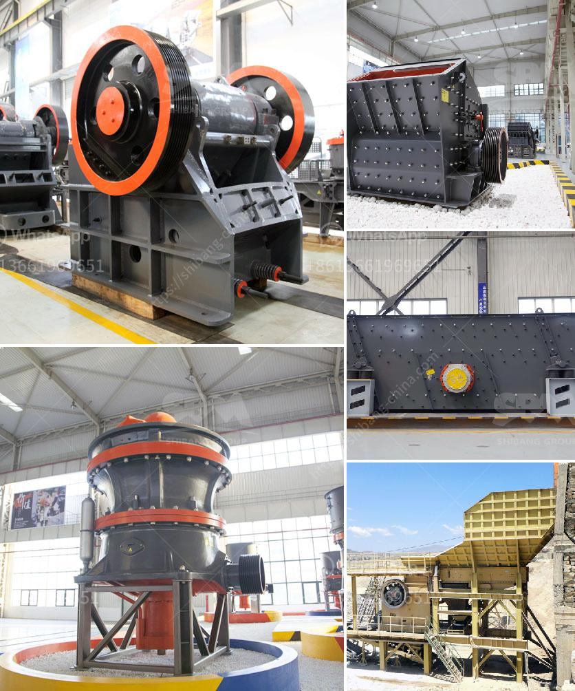

<h3>ball mill for grinding of soda feldspar</h3>
Ball mill is an essential equipment for grinding soda feldspar into fine powder. It is primarily used for grinding materials in the mining industry. Soda feldspar is 100% pure, and it does not contain any other impurities. This makes it a suitable choice for various industries such as glass manufacturing, ceramic production, and paint manufacturing.

The ball mill machine is equipped with steel balls of various sizes, enabling the machine to carry out different grinding actions at different speeds. This results in a uniform grinding of soda feldspar, producing a finer powder that is used in various applications. The ball mill is also capable of storing and transmitting energy, which is necessary for the grinding process.

The grinding process in a ball mill involves using a combination of pressure and impact forces on the material being ground. This is achieved by rotating the ball mill at a certain speed, allowing the steel balls to fall and impact the material to be ground. As the balls collide with the material, they crush and grind it into a fine powder.

One of the advantages of using a ball mill for grinding soda feldspar is its ability to produce a consistent and uniform product. This is important in industries such as ceramic production, where a consistent particle size is required for the manufacturing of ceramic tiles, bowls, and other products. The ball mill also offers other benefits such as low energy consumption, low maintenance requirements, and easy operation.

In conclusion, the ball mill is a versatile and efficient machine that is used for grinding soda feldspar into fine powder. It is an essential piece of equipment in industries such as glass manufacturing, ceramic production, and paint production. The ball mill offers several advantages, including its ability to produce a consistent and uniform product, low energy consumption, and easy operation.
<h3>Contact us</h3><ul><li><strong>Whatsapp:&nbsp;<a href="https://wa.me/8613661969651">+8613661969651</a></strong></li><li><a href="https://swt.shibang-china.com/?git&amp;zhl&amp;ball mill for grinding of soda feldspar"><strong>Online Service(chat now)</strong></a></li></ul><h3>Related</h3><ul><li><a href='granite quarry crusher in nigeria.md'>granite quarry crusher in nigeria</a></li><li><a href='mini cement plant for sale in south africa.md'>mini cement plant for sale in south africa</a></li><li><a href='industrial grinder in algeria.md'>industrial grinder in algeria</a></li><li><a href='ball mill to buy in peru.md'>ball mill to buy in peru</a></li><li><a href='gravel sand wash plants canada for sale.md'>gravel sand wash plants canada for sale</a></li></ul>