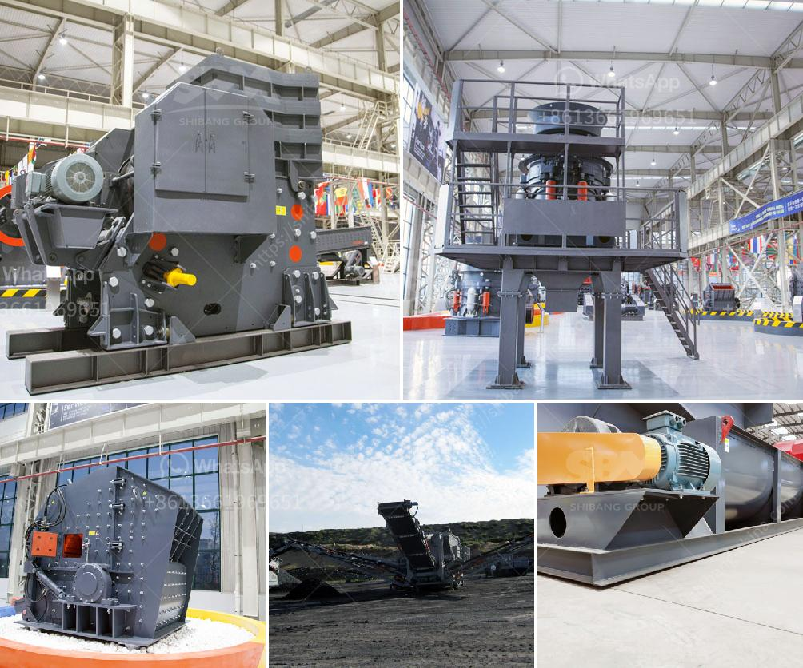

<h3>ball mill for limestone grinding power calculation</h3>
Ball mill for limestone grinding power calculation is one of the key factors to consider when designing and choosing the optimal machinery for limestone milling projects. In fact, limestone grinding power calculation determines the capacity and energy efficiency of the mill system. At the same time, it also affects the quality of the finished product. Therefore, accurate power calculations are vital for successful limestone grinding operations.

Power calculation for limestone grinding requires certain parameters to be known, such as the Limestone Specific Gravity (SG), Bond Work Index (BWI), feed size and desired product size. These parameters help in determining the power requirements, mill dimensions, and the size of the grinding media.

The Bond Work Index is a measure of the resistance of the material to grinding. It represents the energy required to reduce the particle size from a specified feed size to a specific product size. The BWI test provides a standardized method for determining the grinding efficiency of limestone and various other materials.

Once the Bond Work Index is determined, it can be used to calculate the energy requirements for limestone grinding in a ball mill. The power calculation involves the following steps:

1. Determine the number of grinding balls required based on the volume of the mill and the desired fineness of the limestone grind.

2. Calculate the motor power required to turn the mill at the specified speed with the specified filling degree.

3. Calculate the charging weight of the grinding balls based on the volume of the mill and the desired fineness of the limestone grind.

4. Determine the mill size based on the required power and the desired fineness of the limestone grind.

The power calculation for limestone grinding in a ball mill is crucial for the successful operation of the mill system. It is well-known that the power consumption increases with the fineness of the product. In order to minimize energy consumption and optimize the grinding process, it is important to select the appropriate mill size, grinding media, and operating conditions.

Furthermore, the power calculation for limestone grinding is not a one-time calculation. It needs to be revisited periodically based on changes in the feed size, product size, or any modifications in the mill system. Regular performance monitoring and optimization of the grinding process are essential to maintain the required power efficiency and product quality.

In conclusion, power calculations for limestone grinding in a ball mill are essential for the successful operation of the mill system. Accurate and up-to-date power calculations help in selecting the right mill size, grinding media, and operating conditions. This, in turn, ensures optimal energy consumption and high-quality limestone grind. It is important to regularly revisit and update the power calculations based on any changes in the feed size or product size to maintain the required efficiency and productivity.
<h3>Contact us</h3><ul><li><strong>Whatsapp:&nbsp;<a href="https://wa.me/8613661969651">+8613661969651</a></strong></li><li><a href="https://swt.shibang-china.com/?git&amp;zhl&amp;ball mill for limestone grinding power calculation"><strong>Online Service(chat now)</strong></a></li></ul><h3>Related</h3><ul><li><a href='galena crushing and processing.md'>galena crushing and processing</a></li><li><a href='gypsum mining crusher in kenya manufacturer.md'>gypsum mining crusher in kenya manufacturer</a></li><li><a href='mills for limestone in bolivia.md'>mills for limestone in bolivia</a></li><li><a href='raymond mill china.md'>raymond mill china</a></li><li><a href='copper processing plants in usa for sale.md'>copper processing plants in usa for sale</a></li></ul>