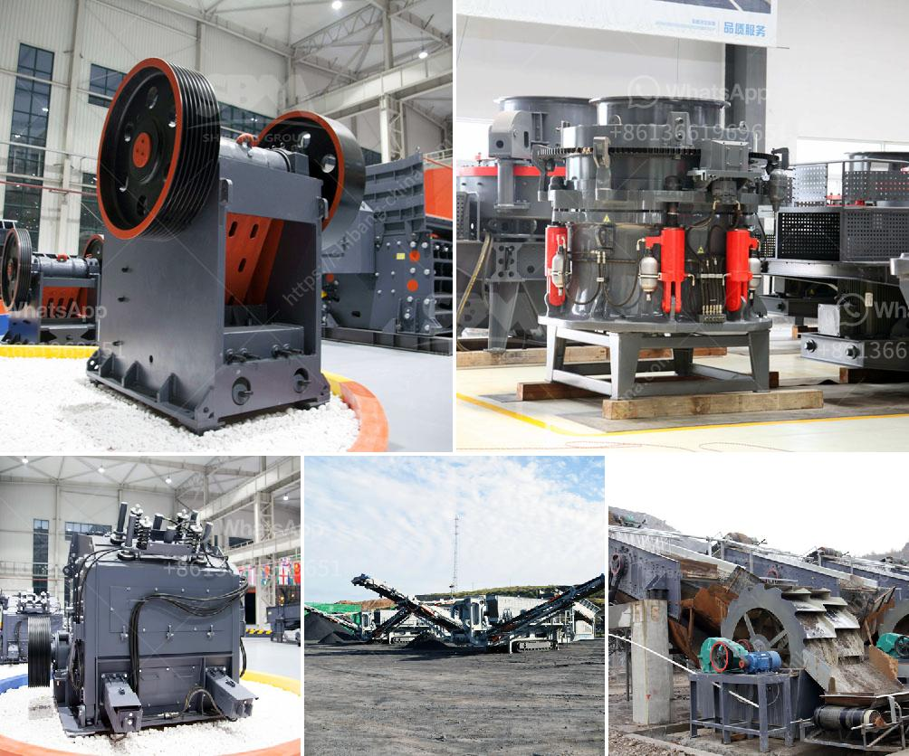

<h3>ball mill grinding in malaysia</h3>
Ball mill grinding is a vital process in many industries, including mineral processing, cement production, chemical synthesis, metallurgy, and more. In Malaysia, ball mills are used in various industries, such as cement, ceramics, steel, coal, functional fillers, and fertilizers, to grind materials. By rotation, the mill is designed to obtain the optimum grinding motion, and the highest possible throughput, in terms of speed and ball charge.

The ball mill consists of a hollow cylindrical shell filled with grinding media, such as steel or ceramic balls. The material to be ground is fed into the shell from one end and is discharged through a narrow slit at the other end, known as the discharge trunnion. As the mill rotates, the grinding media acts as a catalyst to break down and grind the material into a fine powder, resulting in the desired particle size distribution.

In Malaysia, ball mills are commonly used to produce nanoparticles, as well as to grind ores and other materials for subsequent processing. The key factors that influence the grinding efficiency include the size and density of the grinding media, the speed of the mill, the length of the cylindrical shell, and the type and nature of the material being ground.

Another critical aspect in ball mill operation is the control of grinding media wear. The wear of grinding media affects the overall grinding performance and might result in higher maintenance costs if not managed properly. To mitigate this issue, it is common to add grinding aids or modifiers to the mill during the grinding process. These additives can improve the grinding efficiency, reduce wear on the grinding media, and enhance the overall performance of the mill.

In conclusion, ball mill grinding plays a crucial role in various industries in Malaysia. It enables the reduction of large-sized solid materials into smaller particles, ultimately achieving the desired particle size distribution. The control of grinding media wear and the addition of grinding aids are some of the strategies employed to optimize the grinding process. Continuous research and development in this field are important to ensure more efficient and sustainable ball mill grinding practices in Malaysia.
<h3>Contact us</h3><ul><li><strong>Whatsapp:&nbsp;<a href="https://wa.me/8613661969651">+8613661969651</a></strong></li><li><a href="https://swt.shibang-china.com/?git&amp;zhl&amp;ball mill grinding in malaysia"><strong>Online Service(chat now)</strong></a></li></ul><h3>Related</h3><ul><li><a href='jaw crushers in south africa.md'>jaw crushers in south africa</a></li><li><a href='komatsu mobile impact crusher.md'>komatsu mobile impact crusher</a></li><li><a href='roller mill machine.md'>roller mill machine</a></li><li><a href='lokomo jaw crusher.md'>lokomo jaw crusher</a></li><li><a href='estimated cost of setting up a quarry.md'>estimated cost of setting up a quarry</a></li></ul>