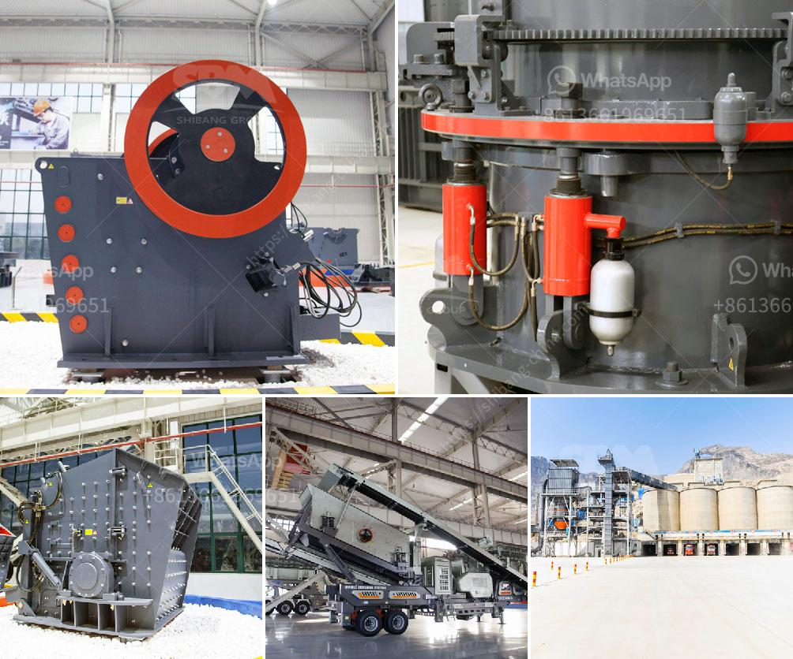

<h3>ball mill in hindi</h3>
बॉल मिल: सभी जानकारी और महत्वपूर्ण बातें

बॉल मिल उद्योग में उपयोग होने वाला एक प्रमुख मशीन है जिसका उद्देश्य चट्टानी पदार्थों को पीसना है। यह मशीन एक विशाल बरतन होता है जिसमें मोटी बाल्लें होती हैं, जिनका उपयोग पदार्थों को पेस्ट बनाने के लिए किया जाता है। यह उपकरण प्राकृतिक उपयोगशाली धातु से निर्मित होता है और उच्च गुणवत्ता और दीर्घकालिक संचालन की दृष्टि से अत्यंत महत्वपूर्ण है।

बॉल मिल का प्रमुख प्रभाव चट्टानी पदार्थ को पेस्ट बनाने का काम करना है। यह मशीन उच्च गति और चक्रणीय धातु-आधारित पदार्थ की प्रभावशीलता का लाभ उठाती है। यह चट्टानी पदार्थ को एक स्थिर माध्यम में पीसता है, जिसका परिणामस्वरूप उन्नत कार्य के लिए उपयोगी पेस्ट निर्माण होता है।

बॉल मिल का उपयोग उद्योग में व्यापक रूप से होता है। इसे कई उद्योगों में प्रयोग किया जाता है, जिनमें इंक, रंग, केमिकल, आहार और द्रवाधारी शामिल हैं। बॉल मिल की गहन ज्ञान और तकनीकी जानकारी व्यक्ति को इसे सफलतापूर्वक संचालित करने में सहायता करती है।

इस मशीन की क्षमता मापती है जो संचालित करने के लिए उपयोगी होती है। इसे मोटाई, बढ़ाने, अवष्टि और परिक्रमा के लिए नंबर से नापा जाता है। यह सूचकांक को जानने के लिए महत्वपूर्ण है क्योंकि यह सुनिश्चित करता है कि यह उपकरण एक विशेष उद्योग की आवश्यकताओं को पूरा कर सकेगा या नहीं।

बॉल मिल एक मशीन होती है जिसमें पीसने के साथ-साथ संवहनीय बाल्ले भी होते हैं। ये बाल्ले अनेक मापों में रहते हैं और तनाव के साथ पीसने का कार्य करते हैं। ये बाल्ले उच्च गुणवत्ता की होते हैं और हर समय अच्छी चाल से परिचालित होते हैं।

इस मशीन के मोटे बाल्ले इसकी गति को बढ़ाने में मदद करते हैं। गति के साथ पीसने की प्रक्रिया अवश्य होती है क्योंकि यह माल को रेड्युस के आधार पर हेर-झेर करता है। मशीन के उपयोग से, चट्टानी पदार्थ में रंगों की उपलब्धता बढ़ाने वाले एजेंट्स का इस्तेमाल कम हो जाता है जो उत्पाद को आदर्श प्रकृति का बनाता है।

बॉल मिल का उपयोग उद्योग में चट्टानी पदार्थ के सुषम और मर्दाना टुकड़ों को ओलावृत करने के लिए India में किया जाता है। इसके उत्पादन में सक्रिय भूमिका होती है और इंक, रंग, चर्म और केमिकल उद्योग में भी इसका महत्वपूर्ण योगदान है।

समारोह बेहतरीन रूप से संचालित करेने के लिए इसका ध्यानपूर्वक रख परिपक्वता करना चाहिए। बॉल मिल के उपयोग और संचालन के बारे में पूरी जानकारी होना चाहिए ताकि लक्ष्य को पूरा किया जा सके। इसकी सही देखभाल और नियंत्रण से, एक व्यक्ति इसमें सक्षम हो जाएगा और बॉल मिल का सफल उपयोग कर सकेगा।

संक्षेप में कहें तो, बॉल मिल एक महत्वपूर्ण मशीन है जिसका उपयोग उद्योग में पदार्थों को पेस्ट बनाने के लिए किया जाता है। इसका लाभ, उपयोग, कार्य क्षमता और सही देखभाल एक व्यक्ति को इसे प्रभावी तरीके से उपयोग करने में सहायता करती है।
<h3>Contact us</h3><ul><li><strong>Whatsapp:&nbsp;<a href="https://wa.me/8613661969651">+8613661969651</a></strong></li><li><a href="https://swt.shibang-china.com/?git&amp;zhl&amp;ball mill in hindi"><strong>Online Service(chat now)</strong></a></li></ul><h3>Related</h3><ul><li><a href='hammer mill sale in malaysia.md'>hammer mill sale in malaysia</a></li><li><a href='manganese mining techniques.md'>manganese mining techniques</a></li><li><a href='ball mill quartz.md'>ball mill quartz</a></li><li><a href='ball mill in india.md'>ball mill in india</a></li><li><a href='pebbles aggregate making machine.md'>pebbles aggregate making machine</a></li></ul>