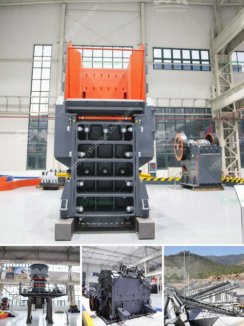

<h3>ball mill in india</h3>
The ball mill is a key equipment for grinding materials, widely used in powder-making production line such as cement, silicate sand, new-type building material, refractory material, fertilizer, ore dressing of ferrous metal and non-ferrous metal, glass ceramics, etc. Ball mill can grind various ores and materials with dry type or wet type.

There are two kinds of ball mills, grate type and overfall type due to different ways of discharging material. The ball mill is a horizontal rotating device transmitted by the outer gear. The materials are transferred to the grinding chamber through the quill shaft uniformly. There are ladder liner and ripple liner and different specifications of steel balls in the chamber.

Ball mills are used for crushing and mixing of raw materials. While rotating, the grinding media (balls, beads, pulps, etc.) and the raw material rotate along with the mill drum. The feed material is grinded as a result of the grinding media shifts and mill drum`s rotation. There are several construction types for the ball mills. The ball mill can be used in both dry and wet method.

Ball mill is the important machine. What ever iron ore , gold ore, manganese , tantalite, zinc beneficiation plant and cement , limestone, marble cut off , talc grinding plant, we all should use the ball mill to complete the key crushing plant.SBM as the ball mill manufacturer in india serve for 5946 clients all over the wold.

The production capacity of NEELACHAL ISPAT NIGAM LTD. for pig iron Plant is 1.1 million tons per year. There are 2 ball mills operates in closed circuit with cyclones to produce the feed for the smelting furnaces. The ore is ground to a size P80 of 85 µm in the closed circuit operation. The ball mill is 6.0 m by 7.0 m in dimensions. A EIPL team of world class engineers were assembled at the NEELACHAL workshop assemblying the ball mill. Also quality inspections at workshop were done by the client and after these quality inspections, the ball mill was delivered by sea to NEELACHAL and during the shipping there was no damage to the product. Some of the parts used for this project were brought from suppliers in India. And the facility is now under operation sucessfully.

In conclusion, Ball Mills are crucial equipment for grinding after materials are crushed. It is an efficient tool for grinding various materials into powder.There are two ways of grinding: the dry process and the wet process. It can be divided into tabular type and flowing type according to different forms of discharging material. Ball mills have many advantages, such as low investment, low energy consumption, simple structure, easy operation, and reliable performance in dry grinding, wet grinding and mixing. They are highly efficient grinding mill machines, designed for grinding applications, where fine material is required. 

Overall, the ball mill in India is the ideal choice for grinding and mixing any critical applications needing it to be performed with utmost care to avoid any operational glitches.
<h3>Contact us</h3><ul><li><strong>Whatsapp:&nbsp;<a href="https://wa.me/8613661969651">+8613661969651</a></strong></li><li><a href="https://swt.shibang-china.com/?git&amp;zhl&amp;ball mill in india"><strong>Online Service(chat now)</strong></a></li></ul><h3>Related</h3><ul><li><a href='calcite processing equipment.md'>calcite processing equipment</a></li><li><a href='sand screener and washer.md'>sand screener and washer</a></li><li><a href='prices of sand making machine.md'>prices of sand making machine</a></li><li><a href='manufacturers of coal mill in india.md'>manufacturers of coal mill in india</a></li><li><a href='diesel engine stone crusher small for quarry project.md'>diesel engine stone crusher small for quarry project</a></li></ul>