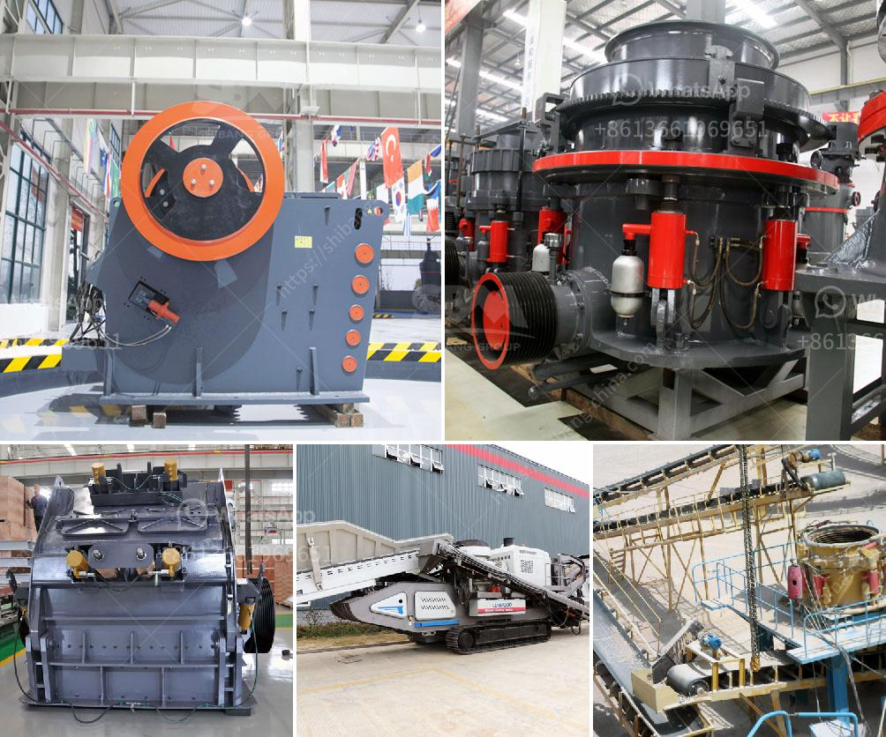

<h3>ball mill in mumbai</h3>
The city of Mumbai, also known as the financial capital of India, is home to a wide array of industries and manufacturing units. One key industry that thrives in this bustling metropolis is the ball mill industry.

A ball mill is a type of grinder used to grind materials into extremely fine powder for use in mineral dressing processes, paints, pyrotechnics, ceramics, and selective laser sintering. The ball mill is a key piece of equipment for grinding crushed materials, and it is widely used in production lines for powders such as cement, silicates, refractory material, fertilizer, glass ceramics, etc. as well as for ore dressing of both ferrous and non-ferrous metals.

In Mumbai, there are numerous ball mill manufacturers, suppliers, and exporters situated The prominent and leading manufacturers of ball mills in Mumbai are Promas Engineers, Techno designs, PVT. Ltd, P AUL O. ABBE Equipment Company, etc. These manufacturers offer a wide range of ball mills that are designed to meet the grinding needs of different industries.

The ball mills manufactured by these companies are highly efficient, reliable, and durable. They are made using top-quality materials and cutting-edge technology to ensure optimal performance and long service life. The manufacturers in Mumbai provide ball mills in various sizes and capacities to cater to the diverse needs of different industries.

The ball mill industry in Mumbai has witnessed substantial growth in recent years due to the increasing demand for finely ground mineral powders and materials. Industries such as cement, paint, ceramics, glass, and pharmaceuticals heavily rely on ball mills for material grinding and particle size reduction. Additionally, with the growing focus on sustainable and eco-friendly practices, many manufacturers in Mumbai are offering energy-efficient ball mills that have low power consumption.

The ball mill industry in Mumbai has contributed significantly to the city's economic growth and employment generation. The presence of reliable manufacturers and suppliers has made Mumbai a hub for the production and distribution of ball mills in India and even across the globe.

In conclusion, the ball mill industry in Mumbai plays a vital role in various sectors, including construction, mining, chemical, and pharmaceutical industries. The city's manufacturers and suppliers offer high-quality ball mills that are efficient, durable, and eco-friendly, enabling industries to achieve their production targets effectively. With its continuous growth and innovation, the ball mill industry in Mumbai is poised to scale new heights in the coming years.
<h3>Contact us</h3><ul><li><strong>Whatsapp:&nbsp;<a href="https://wa.me/8613661969651">+8613661969651</a></strong></li><li><a href="https://swt.shibang-china.com/?git&amp;zhl&amp;ball mill in mumbai"><strong>Online Service(chat now)</strong></a></li></ul><h3>Related</h3><ul><li><a href='diagram of stone crusher operation.md'>diagram of stone crusher operation</a></li><li><a href='crushing plant for sale in tanzania.md'>crushing plant for sale in tanzania</a></li><li><a href='chalcopyrite ore processing plant cost to built and sale.md'>chalcopyrite ore processing plant cost to built and sale</a></li><li><a href='custom milling for small scale mining.md'>custom milling for small scale mining</a></li><li><a href='manufacturer crusher machines contacts.md'>manufacturer crusher machines contacts</a></li></ul>