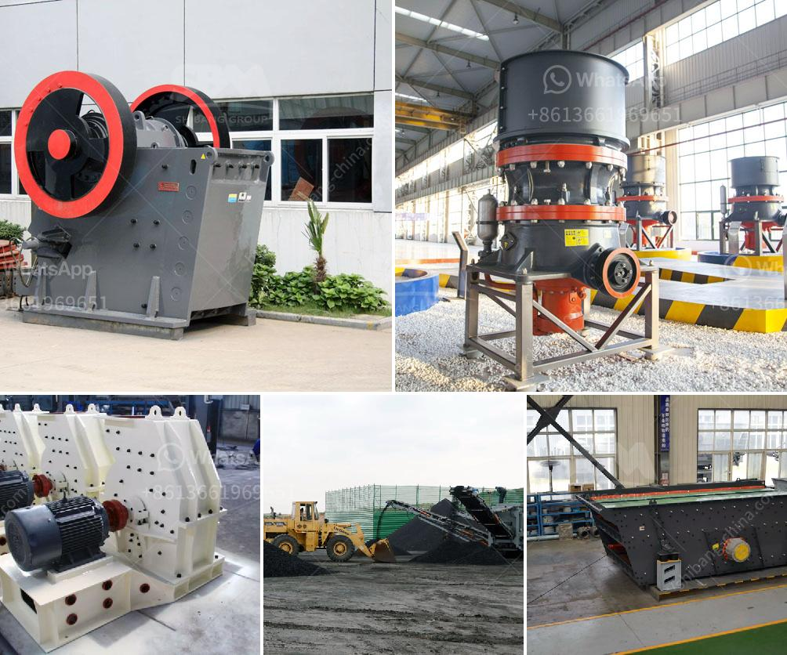

<h3>ball mill lining made in china</h3>
Ball mills are widely used in the production of cement, silicate products, new building materials, refractory materials, fertilizers, black and non-ferrous metal dressings, and glass ceramics, among others. They are crucial equipment for grinding materials after they are crushed. 

An important component of these mills is their lining, which protects the mill shell from wear and tear, and ensures smooth operations. China has emerged as a major producer of ball mill linings, with numerous manufacturers offering a diverse range of products. These linings are known for their high quality, durability, and cost-effectiveness. 

One of the leading manufacturers of ball mill linings in China is Xinhai Mining Machinery Co., Ltd. They manufacture and supply durable ball mill linings that provide optimum grinding efficiency, improve product quality, and reduce power consumption. These linings are made from high-quality rubber, wear-resistant steel, and composite materials. 

The rubber linings offered by Xinhai are designed to withstand the abrasive effects of the grinding media and the corrosive effects of the materials being processed. They offer excellent resistance to impact, corrosion, and high temperatures, making them perfect for use in ball mills. The rubber linings also reduce noise levels generated during grinding, creating a better working environment. 

Xinhai's wear-resistant steel linings are made from high-quality alloy steel, which is heat-treated to enhance its toughness and wear resistance. These linings are highly durable and can withstand the harshest operating conditions, extending the lifespan of the mill. They also promote efficient grinding by preventing the balls from slipping and impacting on the shell. 

In addition to rubber and steel linings, Xinhai also offers composite linings, which combine the advantages of both materials. These linings are made from a combination of rubber and steel, providing a perfect balance between wear resistance and impact resistance. The composite linings offer superior performance in terms of grinding efficiency, product quality, and energy consumption. 

Apart from Xinhai, there are several other manufacturers in China that specialize in ball mill linings. These manufacturers use advanced technology and production techniques to ensure the highest quality standards. They invest heavily in research and development to develop innovative solutions that meet the needs of their customers. 

As China continues to be a leading manufacturer and exporter of ball mill linings, it is crucial for buyers to choose reliable suppliers that offer superior products and services. They should look for manufacturers with a strong reputation in the industry, extensive experience, and a proven track record of delivering high-quality products. 

In conclusion, ball mill linings made in China are known for their efficiency and longevity. Manufacturers like Xinhai Mining Machinery Co., Ltd. offer a wide range of high-quality linings that enhance grinding efficiency, reduce energy consumption, and improve product quality. These linings are made from rubber, wear-resistant steel, and composite materials, providing effective protection to the mill shell. As China continues to lead in the production of ball mill linings, buyers should make informed choices and select reliable suppliers to ensure optimal performance and durability.
<h3>Contact us</h3><ul><li><strong>Whatsapp:&nbsp;<a href="https://wa.me/8613661969651">+8613661969651</a></strong></li><li><a href="https://swt.shibang-china.com/?git&amp;zhl&amp;ball mill lining made in china"><strong>Online Service(chat now)</strong></a></li></ul><h3>Related</h3><ul><li><a href='chalcopyrite ore processing plant cost to built and sale.md'>chalcopyrite ore processing plant cost to built and sale</a></li><li><a href='different type of grinding mills.md'>different type of grinding mills</a></li><li><a href='crusher plant price komatsu.md'>crusher plant price komatsu</a></li><li><a href='mill for barite powder.md'>mill for barite powder</a></li><li><a href='stone quarry process.md'>stone quarry process</a></li></ul>