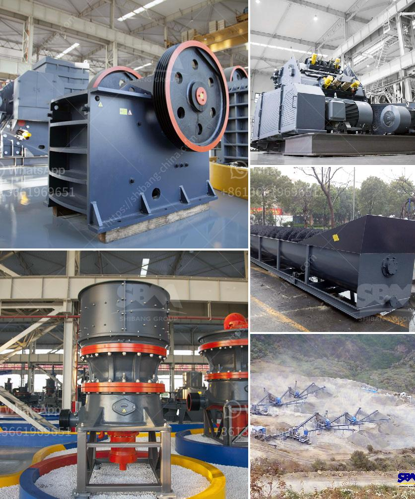

<h3>ball mill machine price</h3>
The ball mill machine is a key equipment used to grind and crush materials in the manufacturing, building materials, and chemical industries. With its wide range of applications, the ball mill machine has become indispensable in many industries.

One of the most important factors in purchasing a ball mill machine is the machine's price. With a wide range of prices available, it can be challenging to find the right blend of quality and affordability. To help you make an informed decision, this article explores the factors that influence ball mill machine prices.

1. Machine size: The size of the ball mill machine affects its price. Larger machines are more expensive, as they require more advanced technology and materials to manufacture. Smaller machines, on the other hand, may be more affordable.

2. Machine capacity: The capacity of the ball mill machine also impacts its price. Higher capacity machines are generally more expensive as they can process larger quantities of materials at a time. However, if you do not require a high capacity machine, opting for a smaller one with a lower price may be a more cost-effective choice.

3. Machine materials: The materials used in the construction of the ball mill machine can heavily influence the price. Machines made from high-quality materials such as stainless steel are generally more expensive but offer greater durability and longer lifespan. On the other hand, machines made from lower-quality materials may have a lower price tag but may not offer the same level of performance and longevity.

4. Manufacturer reputation and location: The reputation and location of the manufacturer can also have an impact on the price of the ball mill machine. Well-established and reputable manufacturers tend to charge higher prices for their machines due to their brand value and customer trust. Machines manufactured in countries with lower labor and production costs may be priced more competitively.

5. Additional features: Some ball mill machines come with additional features and accessories, such as automation systems, cooling systems, and digital displays. These added features can improve the efficiency and ease of use of the machine but may also increase its price. Consider whether these additional features are necessary for your specific needs before making a purchase.

When looking for a ball mill machine, it is essential to strike a balance between price and quality. While a lower-priced machine may be tempting, it may sacrifice performance and longevity. Conversely, an expensive machine may exceed your needs and budget. Consider the factors mentioned above to find the best ball mill machine price that meets your requirements and budget.
<h3>Contact us</h3><ul><li><strong>Whatsapp:&nbsp;<a href="https://wa.me/8613661969651">+8613661969651</a></strong></li><li><a href="https://swt.shibang-china.com/?git&amp;zhl&amp;ball mill machine price"><strong>Online Service(chat now)</strong></a></li></ul><h3>Related</h3><ul><li><a href='second hand coal mining crushers in zimbabwe.md'>second hand coal mining crushers in zimbabwe</a></li><li><a href='gravel sand wash plants canada for sale.md'>gravel sand wash plants canada for sale</a></li><li><a href='cone crushers made in italy.md'>cone crushers made in italy</a></li><li><a href='cement grinding plant layout.md'>cement grinding plant layout</a></li><li><a href='gold mining mercury.md'>gold mining mercury</a></li></ul>