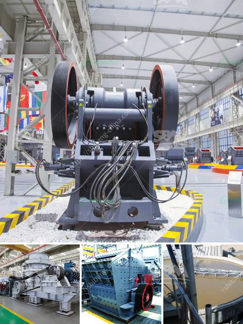

<h3>ball mill machinery manufacturer india</h3>
Ball mill machinery is an essential device and equipment for any mining or metallurgy project. In India, ball mill machinery manufacturers are known for their high-performance machinery. They provide users with advanced machinery that helps to streamline their mining and metallurgy processes.

Ball mills are typically designed to grind different kinds of ores and other hard materials for their respective purposes. They are used for grinding materials such as coal, pigments, feldspar, and more. The ball mill machinery is also utilized in mining operations for the grinding of valuable ores such as gold, copper, and silver.

Being a crucial component of many industries, ball mill machinery manufacturers in India keep up with the latest trends in the market and deliver cutting-edge machinery with advanced features. These features ensure that the machinery delivers high performance, efficiency, and reliability, enabling the businesses to increase their productivity and profitability.

One of the leading ball mill machinery manufacturers in India is Aimil Ltd. The company specializes in providing high-quality machinery products to various industries. Aimil Ltd. manufactures and supplies a variety of ball mill machinery for mining and metallurgy applications.

Their products are designed and manufactured using advanced technologies, high-quality materials, and strict quality control measures. This ensures that the machinery is durable, robust, and can withstand harsh working conditions. The ball mill machinery provided by Aimil Ltd. is known for its excellent performance, low maintenance, and long operational life. This makes it an ideal choice for businesses looking to enhance their mining and metallurgy processes.

Ball mill machinery manufacturers in India offer a wide range of products to cater to different industry needs. They offer products ranging from laboratory scale ball mill machines to industrial-scale machines capable of handling heavy workloads. They also provide customized solutions tailored to specific requirements, ensuring maximum efficiency and productivity.

In addition to manufacturing high-quality ball mill machinery, these manufacturers also offer comprehensive after-sales services. This includes installation support, regular maintenance, and prompt customer support. Their dedicated teams assist customers in optimizing their machinery performance, addressing any issues, and ensuring the smooth operation of the equipment.

Furthermore, the ball mill machinery manufacturers in India keep themselves updated with the latest advancements in technology. They continuously invest in research and development to improve their machinery's performance, efficiency, and reliability. This allows them to offer state-of-the-art machinery to their customers, enabling them to stay ahead in their respective industries.

To conclude, ball mill machinery manufacturers in India play a vital role in providing high-performance machinery to various industries. Their advanced machinery helps streamline the mining and metallurgy processes, enhancing productivity and profitability. With their dedication to quality, customer satisfaction, and continuous innovation, these manufacturers contribute significantly to India's industrial growth.
<h3>Contact us</h3><ul><li><strong>Whatsapp:&nbsp;<a href="https://wa.me/8613661969651">+8613661969651</a></strong></li><li><a href="https://swt.shibang-china.com/?git&amp;zhl&amp;ball mill machinery manufacturer india"><strong>Online Service(chat now)</strong></a></li></ul><h3>Related</h3><ul><li><a href='overhaul jaw crusher.md'>overhaul jaw crusher</a></li><li><a href='trapezium grinding mill.md'>trapezium grinding mill</a></li><li><a href='jaw crusher machine.md'>jaw crusher machine</a></li><li><a href='stone crushers machine price in nepal.md'>stone crushers machine price in nepal</a></li><li><a href='iron ore processing equipment.md'>iron ore processing equipment</a></li></ul>