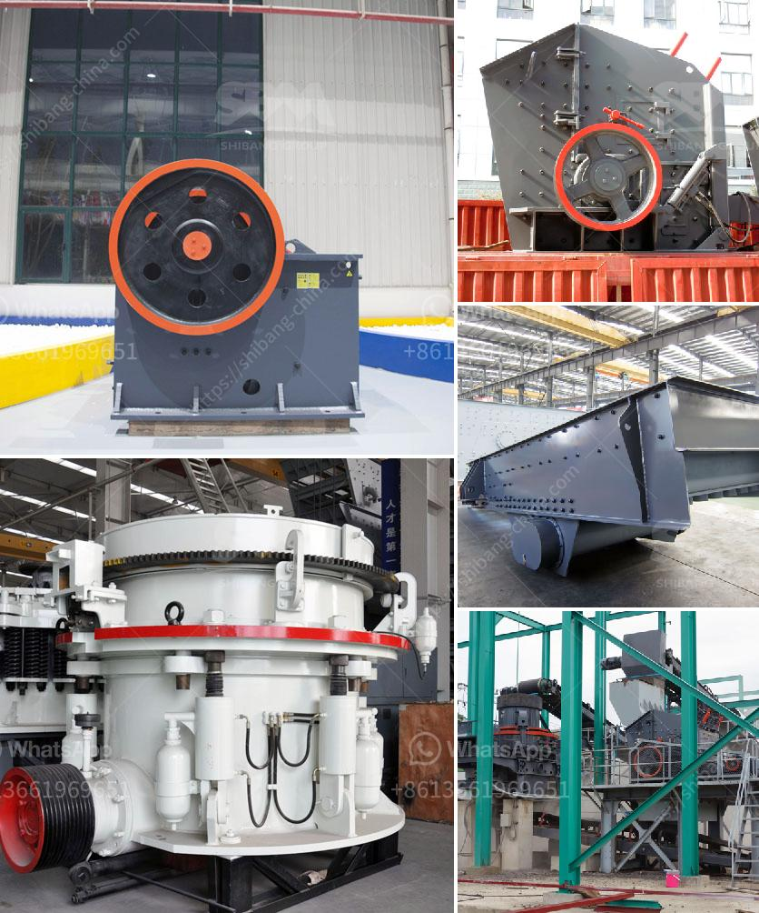

<h3>ball mill manufacturer in sri lanka</h3>
Sri Lanka has gained a reputation as a global manufacturing hub due to its strategic location and robust industrial landscape. One such industry that has flourished in the country is the manufacturing of ball mills. As the demand for these industrial machines increases for various applications, local manufacturers have seized the opportunities to produce and supply them to both domestic and international markets.

Ball mills are essential equipment in many industries, including mining, construction, pharmaceuticals, and chemicals. They are used to grind materials into finer particles, enabling efficient production processes and high-quality products. A ball mill consists of a rotating cylinder filled with balls of different sizes, which effectively grind the material, creating a controlled and homogeneous mixture.

There are several key factors that contribute to Sri Lanka becoming a top choice for ball mill manufacturing. Firstly, the country has a strong pool of skilled engineers and technicians who possess the expertise required to design and assemble these machines. They are well-versed in the latest technological advancements and capable of meeting diverse client requirements.

Furthermore, Sri Lanka boasts a well-established infrastructure that supports the manufacturing industry, including reliable transportation networks and access to raw materials. The presence of local suppliers of components and spare parts further enhances the efficiency of the manufacturing process, reducing lead times and costs.

Additionally, many ball mill manufacturers in Sri Lanka prioritize quality and customer satisfaction. They adhere to international standards and industry best practices to deliver machines that meet stringent performance criteria. Whether it is a small-scale laboratory ball mill or a large industrial unit, manufacturers ensure that utmost precision and durability are maintained in each product.

The manufacturing of ball mills in Sri Lanka has contributed significantly to the country's economic growth, providing employment opportunities and attracting foreign investments. Moreover, local manufacturers are actively engaged in research and development to incorporate new technologies and improve the efficiency of these machines.

In conclusion, the ball mill manufacturing industry in Sri Lanka has experienced remarkable growth and success over the years. The country's skilled workforce, robust infrastructure, and dedication to quality have made it a preferred choice for both domestic and international clients. As the demand for ball mills continues to rise, Sri Lankan manufacturers are poised to play a vital role in meeting the global needs of various industries.
<h3>Contact us</h3><ul><li><strong>Whatsapp:&nbsp;<a href="https://wa.me/8613661969651">+8613661969651</a></strong></li><li><a href="https://swt.shibang-china.com/?git&amp;zhl&amp;ball mill manufacturer in sri lanka"><strong>Online Service(chat now)</strong></a></li></ul><h3>Related</h3><ul><li><a href='cost of mobile crusher in india.md'>cost of mobile crusher in india</a></li><li><a href='kaolin clay processing flow chart.md'>kaolin clay processing flow chart</a></li><li><a href='rock crusher quarry.md'>rock crusher quarry</a></li><li><a href='roller mill from china.md'>roller mill from china</a></li><li><a href='jaw crusher with protection.md'>jaw crusher with protection</a></li></ul>