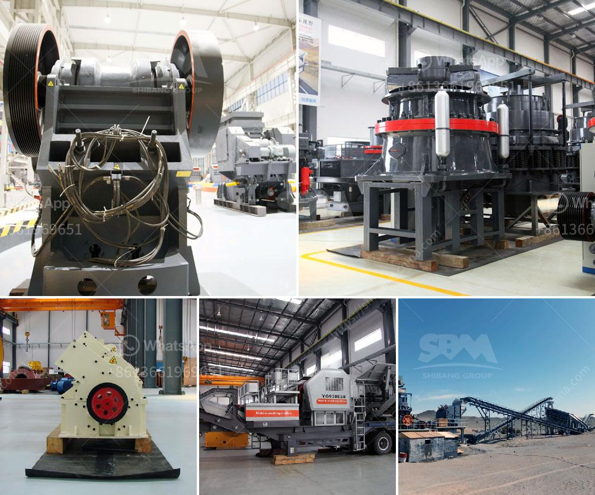

<h3>ball mill nigeria</h3>
Ball mill Nigeria controls the performance of the grinding process. This equipment provides optimal conditions for the grinding operation of various materials. With the advancement of technology and the increase in the scale of production, ball mill Nigeria is gradually moving towards large-scale and high-efficiency production. The technical content and quality of ball mill Nigeria equipment have been continuously improved and developed.

The ball mill Nigeria is divided into two types: intermittent ball mill and continuous ball mill. The intermittent ball mill is suitable for grinding materials with small size and low hardness, while the continuous ball mill is suitable for grinding materials with large size and high hardness. The continuous ball mill has the advantages of large production capacity, simple structure, stable and reliable operation, low noise and less dust pollution.

Ball mill Nigeria grinds material by rotating a cylinder with steel grinding balls, causing the balls to fall back into the cylinder and onto the material to be ground. The rotation is usually between 4 to 20 revolutions per minute, depending upon the diameter of the mill. The larger the diameter, the slower the rotation. If the peripheral speed of the mill is too great, it begins to act like a centrifuge and the balls do not fall back, but stay on the perimeter of the mill.

Ball mill Nigeria is widely used in small and medium-sized mineral processing plants, cement plants, power plants, chemical plants and other industries. Ball mill Nigeria grinding process is commonly used in multiple grinding stages, and the optimization of the technical process of ball mill Nigeria can reduce the investment cost of production. In the early stage of grinding, the fineness of the ore is large, and the grinding time is long, so it is usually not suitable to use the intermittent ball mill. However, as the ore grinding fineness increases, the ball mill Nigeria can achieve a relatively high grinding efficiency.

Ball mill Nigeria is a key equipment for milling the materials into powders after they are crushed. It has been widely used in many production industries such as cement, silicate, new type building materials, refractory materials, fertilizers, ferrous metals, non-ferrous metals, glass, ceramics, and so on. The ball mill Nigeria can grind various ores and other materials either wet or dry.

In conclusion, ball mill Nigeria is crucial equipment for grinding materials in various industries. It is widely used in mineral processing, cement, silicate products, new type building materials, refractories, fertilizers, black and non-ferrous metal beneficiation, and glass-ceramic industries. As the development and utilization of mineral resources continue to increase, ball mill Nigeria will play a greater role in the cement and mining industries. Its technical performance and function will continue to be optimized and improved, providing better support for production and processing activities.
<h3>Contact us</h3><ul><li><strong>Whatsapp:&nbsp;<a href="https://wa.me/8613661969651">+8613661969651</a></strong></li><li><a href="https://swt.shibang-china.com/?git&amp;zhl&amp;ball mill nigeria"><strong>Online Service(chat now)</strong></a></li></ul><h3>Related</h3><ul><li><a href='project report of a tph stone crusher.md'>project report of a tph stone crusher</a></li><li><a href='stone principle crusher project.md'>stone principle crusher project</a></li><li><a href='dolomite ore processing.md'>dolomite ore processing</a></li><li><a href='vertical hammer crusher.md'>vertical hammer crusher</a></li><li><a href='stone crusher uk.md'>stone crusher uk</a></li></ul>